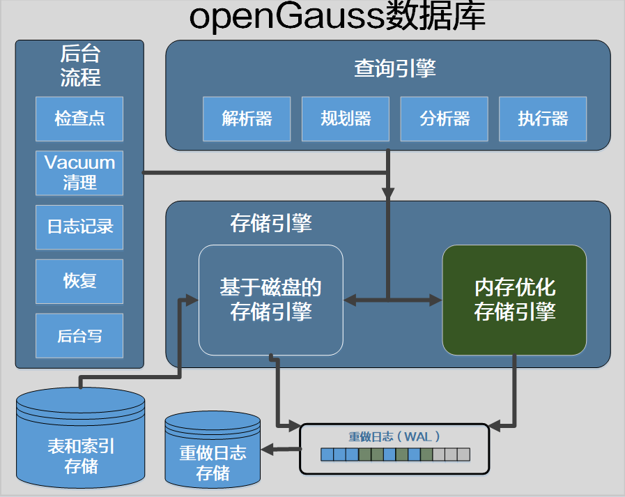

# Introduction to MOT

openGauss introduces the MOT storage engine, which is a transactional row storage and is optimized for multi-core and large-memory servers. MOT is the most advanced production-level feature \(Beta version\) of openGauss databases. It provides higher performance for transactional workloads. MOT fully supports ACID features and includes strict persistence and high availability support. Enterprises can use MOT in mission-critical and performance-sensitive online transaction processing \(OLTP\) to achieve high performance, high throughput, predictable low latency, and high utilization of multi-core servers. MOT is especially suitable for running on modern servers with multi-channel and multi-core processors, such as Huawei TaiShan servers based on ARM/ Kunpeng processors and Dell or similar x86 servers.

**Figure  1**  openGauss memory-optimized storage engine  

As shown in  [Figure 1](#fig63302056479), the openGauss database memory optimization storage engine component \(the green module\) manages the MOT and transactions.

MOT and disk-based common tables are created side by side. The effective design of MOT implements almost complete SQL coverage and supports a complete set of database functions, such as stored procedures and user-defined functions \(for details about restrictions, see  [MOT SQL Coverage and Limitations](mot-sql-coverage-and-limitations.md)\).

MOT provides faster data access and more efficient transaction execution through data and indexes completely stored in memory, non-uniform memory access-aware \(NUMA-aware\) design, algorithms that eliminate locks and lock contention, and query native compilation.

The lock-free design and highly optimized implementation of MOT enable it to achieve excellent near-linear throughput expansion on multi-core servers, which may be the best in the industry.

The MOT completely supports the ACID feature:

-   Atomicity: An atomic transaction is a series of inseparable database operations. After a transaction is completed \(committed or aborted\), either all or none of these operations occur.
-   Consistency: After a transaction is complete, the database is in the consistent state and data integrity is retained.
-   Isolation: Transactions cannot interfere with each other. MOT supports different isolation levels for repeated reads and read commits. In the next release, MOT will also support serializable isolation. For more information, see  [MOT Isolation Levels](mot-isolation-levels.md).
-   Durability: The effect of a successfully completed \(submitted\) transaction is persisted even if a crash or failure occurs. The MOT is integrated with the WAL-based log recording function of the openGauss. Both synchronous and asynchronous log options are supported. MOT also supports synchronous + NUMA-optimized group commit. For more information, see  [MOT Durability Concepts](mot-durability-concepts.md).

