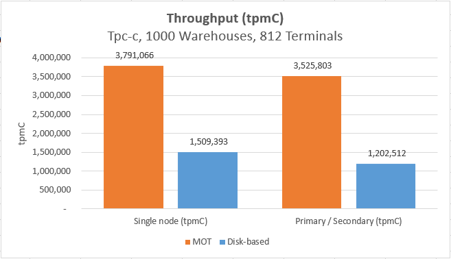
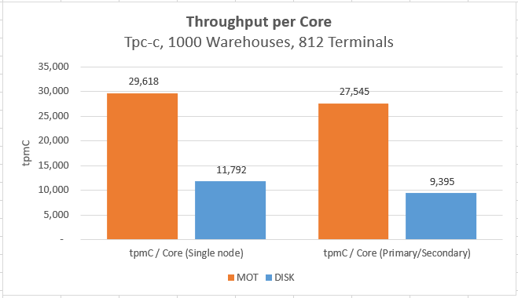
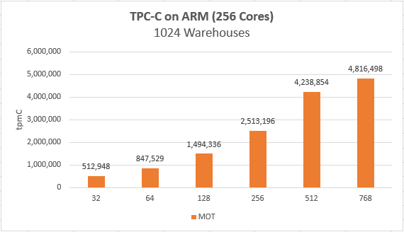
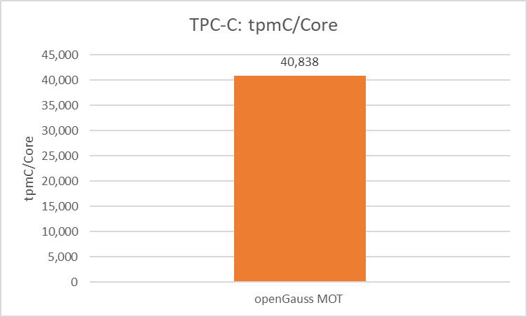

# MOT High Throughput

The following shows the results of various MOT table high throughput tests.

## ARM/Kunpeng 2-Socket 128 Cores

**Performance**

The following figure shows the results of testing the TPC-C benchmark on a Huawei ARM/Kunpeng server that has two sockets and 128 cores.

Four types of tests were performed –

-   Two tests were performed on MOT tables and another two tests were performed on openGauss disk-based tables.
-   Two of the tests were performed on a Single node \(without high availability\), meaning that no replication was performed to a secondary node. The other two tests were performed on Primary/Secondary nodes \(with high availability\), meaning that data written to the primary node was replicated to a secondary node.

MOT tables are represented in orange and disk-based tables are represented in blue.

**Figure  1**  ARM/Kunpeng 2-Socket 128 Cores – Performance Benchmarks  

The results showed that:

-   As expected, the performance of MOT tables is significantly greater than of disk-based tables in all cases.
-   For a Single Node – 3.8M tpmC for MOT tables versus 1.5M tpmC for disk-based tables
-   For a Primary/Secondary Node – 3.5M tpmC for MOT tables versus 1.2M tpmC for disk-based tables
-   For production grade \(high-availability\) servers \(Primary/Secondary Node\) that require replication, the benefit of using MOT tables is even more significant than for a Single Node \(without high-availability, meaning no replication\).
-   The MOT replication overhead of a Primary/Secondary High Availability scenario is 7% on ARM/Kunpeng and 2% on x86 servers, as opposed to the overhead of disk tables of 20% on ARM/Kunpeng and 15% on x86 servers.

**Performance per CPU core**

The following figure shows the TPC-C benchmark performance/throughput results per core of the tests performed on a Huawei ARM/Kunpeng server that has two sockets and 128 cores. The same four types of tests were performed \(as described above\).

**Figure  2**  ARM/Kunpeng 2-Socket 128 Cores – Performance per Core Benchmarks  

The results showed that as expected, the performance of MOT tables is significantly greater per core than of disk-based tables in all cases. It also shows that for production grade \(high-availability\) servers \(Primary/Secondary Node\) that require replication, the benefit of using MOT tables is even more significant than for a Single Node \(without high-availability, meaning no replication\).

## ARM/Kunpeng 4-Socket 256 Cores

The following demonstrates MOT's excellent concurrency control performance by showing the tpmC per quantity of connections.

**Figure  3**  ARM/Kunpeng 4-Socket 256 Cores – Performance Benchmarks  

The results show that performance increases significantly even when there are many cores and that peak performance of 4.8M tpmC is achieved at 768 cores.

## x86-based Servers

-   **8-Socket 384 Cores**

The following demonstrates MOT’s excellent concurrency control performance by comparing the tpmC per quantity of connections between disk-based tables and MOT. This test was performed on an X86 server with eight sockets and 384 cores. The orange represents the results of the MOT table.

**Figure  4**  x86 8-Socket 384 Cores – Performance Benchmarks  

The results show that MOT tables significantly outperform disk-based tables and have very highly efficient performance per core on a 386 core server, reaching over 3M tpmC / core.

-   **4-Socket 96 Cores**

3.9 million tpmC was achieved by MOT on this 4-socket 96 cores server. The following figure shows a highly efficient MOT table performance per core reaching 40,000 tpmC / core.

**Figure  5**  4-Socket 96 Cores – Performance Benchmarks  

