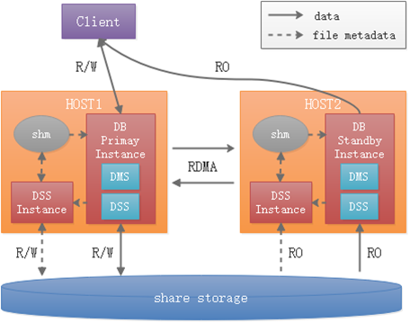

# Primary/Standby Shared Storage

## Availability

This feature is available since openGauss 3.1.0.

## Introduction

This feature enables the primary and standby nodes to share the same storage, implementing HA deployment mode for the primary/standby shared storage based on disk arrays. OCK RDMA can be used to improve the real-time read consistency on standby nodes. The following figure shows the architecture of the primary/standby shared storage.

**Figure 1** Primary/Standby shared storage architecture  

## Benefits

In traditional HA deployment mode, the storage capacity is doubled compared with that of a single node. This feature reduces the storage capacity and saves disk arrays. In addition, OCK RDMA can be used to improve the real-time read consistency on standby nodes.

## Description

-   The primary/standby shared storage depends on two Huawei-developed components:
    -   Distributed Storage Service (DSS)

        The DSS process is an independent process that directly manages raw devices of disk arrays and provides capabilities similar to distributed file systems for external systems. The shared memory and client API dynamic library provide the database with the capabilities of creating files, deleting files, expanding and shrinking files, and reading and writing files.

    -   Distributed Memory Service (DMS)

        DMS is a dynamic library integrated in the database. It transmits page content through the TCP/RDMA network, integrates the primary and standby memories, and provides the memory pooling capability to implement real-time read consistency on the standby node.

-   The DSS component enables the primary and standby nodes to share the same storage. Compared with traditional database creation, when a shared storage database is created based on a disk array, directories are classifies into three types: exclusively used and not shared by each instance, exclusively used and shared by each instance, and shared by all instances. The directories to be shared must be stored on the disk array, and the directories that are not shared must be stored on the local disk. In addition, to create a database on the standby node, you only need to create a directory that belongs to the standby node. You do not need to create a directory structure shared by all instances. GUC parameters are added to the primary/standby shared storage, and the storage mode of system catalogs is switched from page mode to segment-page mode.
-   The shared storage uses the DMS component to implement real-time page exchange between the primary and standby nodes and ensure real-time data consistency on standby nodes. That is, after a transaction is committed on the primary node, the transaction can be read on the standby node immediately. There is no delayed read (the transaction isolation level is read committed).
-   The shared storage uses OCK RDMA to reduce the latency of DMS primary/standby page exchange. Compared with the latency of read consistency on a standby node in TCP mode, when OCK RDMA is enabled, the latency is reduced by at least 20%.

## Enhancements

None

## Constraints

-   The primary/standby shared storage solution depends on disk arrays. The LUN of the disk array must support the SCSI3 PR protocol, including PERSISTENT RESERVE OUT (PR OUT), PERSISTENT RESERVE IN (PR IN), and INQUIRY, to implement cluster IO FENCE. In addition, the COMPARE AND WRITE (CAW) protocol of SCSI3 must be supported to implement shared disk locks. For example, Dorado 5000 V3 disk array.
-   The HA shared storage deployment mode supports only the 1 primary node + 1 standby node and 1 primary node+ 2 standby nodes. Other trial scenarios have not been tested and are not guaranteed.
-   The primary/standby shared storage depends on functions similar to the distributed file system to implement the real-time read consistency of the standby node. Therefore, the less the file metadata changes, the better. To ensure performance, this feature supports only segment-page tables.
-   The primary and standby nodes must be deployed on the same disk array. DR deployment and hybrid deployment of the primary and standby nodes are not supported. For example, the primary and standby nodes are deployed on different disk arrays.
-   Page exchange between the primary and standby nodes is accelerated by RDMA, depending on the CX5 NIC and OCK RDMA dynamic library.
-   Currently, standby node rebuild, node replacement, and node restoration are not supported.
-   Upgrade from the traditional HA deployment to the primary/standby shared storage deployment is not supported.
-   In shared storage, the following functions cannot be used: gs\_xlogdump\_xid, gs\_xlogdump\_lsn, gs\_xlogdump\_tablepath, gs\_xlogdump\_parsepage\_tablepath, pg\_create\_logical\_replication\_slot, gs\_verify\_and\_tryrepair\_page, gs\_repair\_page, and gs\_repair\_file.
-   In shared storage, the following subscription functions are not supported: T\_CreatePublicationStmt, T\_AlterPublicationStmt, T\_CreateSubscriptionStmt, T\_AlterSubscriptionStmt, and T\_DropSubscriptionStmt.
-   Global temporary tables are not supported in shared storage.

## Dependencies

None
