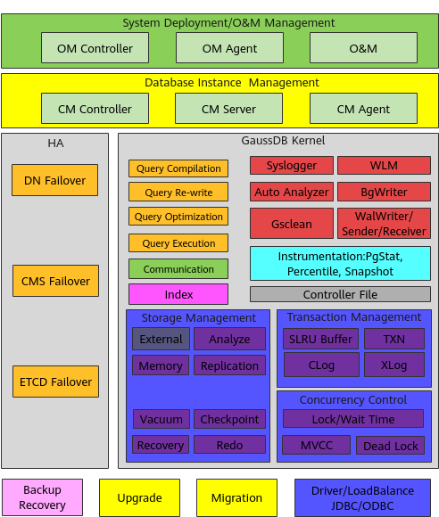

# System KPI-aided Diagnosis

## Availability

This feature is available since openGauss 1.0.0.

## Introduction

KPIs are views of key performance indicators for kernel components or the entire system. Based on KPIs, users can learn about the real-time and historical running status of the system.

## Benefits

-   Summarized system load diagnosis

    Precise alarms for system load exceptions \(overload, stall, and SLA exceptions\) and precise system load profile

-   Summarized system time model diagnosis

    Instance-level and query-level time model segmentation, diagnosing the root causes of instance and query performance problems

-   Query performance diagnosis

    Database-level query summary, including top SQL, SQL CPU usage, I/O consumption, execution plan, and excessive hard parsing

-   Diagnosis of disk I/O, index, and buffer performance problems
-   Diagnosis of connection and thread pool problems
-   Diagnosis of checkpoint and redo \(RTO\) performance problems
-   Diagnosis of system I/O, LWLock, and wait performance problems

    Diagnosis of over 60 modules and over 240 key operation performance problems

-   Function-level performance monitoring and diagnosis \(by GSTRACE\)

    Tracing of over 50 functions at the storage and execution layers

## Description

openGauss provides KPIs of 11 categories and 26 sub-categories, covering instances, files, objects, workload, communication, sessions, threads, cache I/O, locks, wait events, and clusters.

[Figure 1](#fig20286741318)  shows the distribution of kernel KPIs.

**Figure  1**  Distribution of kernel KPIs  

## Enhancements

None

## Constraints

None

## Dependencies

None

