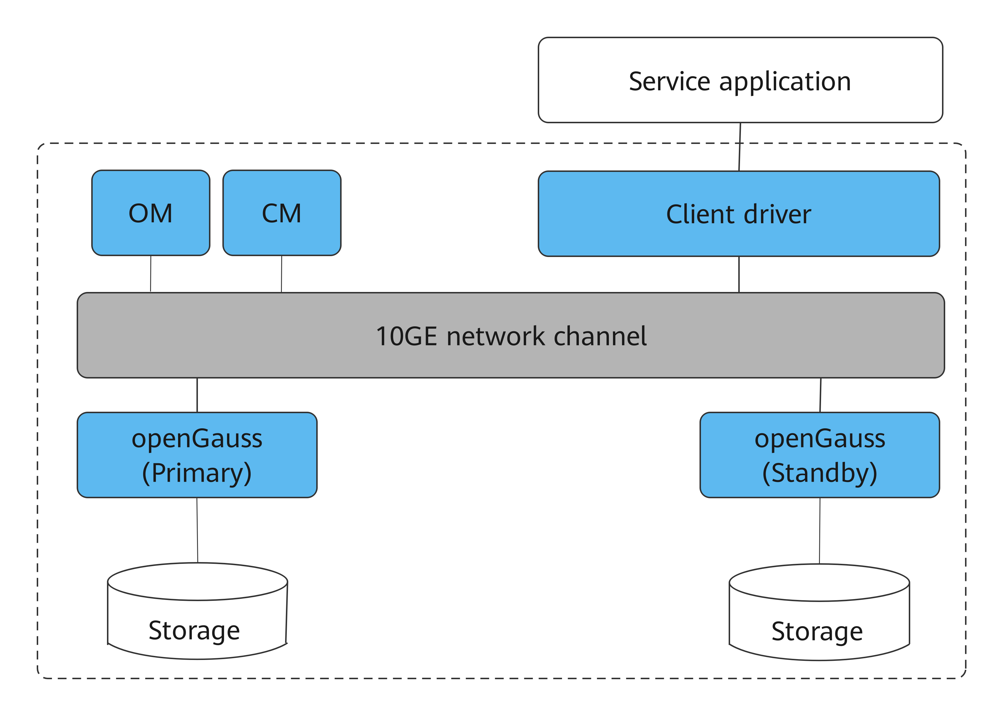

# System Architecture

openGauss is a standalone database where data is stored on a single physical node and data access tasks are pushed to service nodes. In this way, high concurrency of servers enables quick data processing. In addition, data can be copied to the standby server through log replication, ensuring high reliability and scalability.

## Software Architecture

openGauss is a standalone database and can be deployed in primary/standby mode.

openGauss shows the logical components of  [Figure 1](#en-us_topic_0283136530_en-us_topic_0237080634_en-us_topic_0231764167_fig5205420191411).

**Figure  1**  openGauss logical components  

**Table  1**  Architecture description

<table><thead align="left"><tr id="en-us_topic_0283136530_en-us_topic_0237080634_en-us_topic_0231764167_row4411284819151"><th class="cellrowborder" valign="top" width="14.469999999999999%" id="mcps1.2.3.1.1">
Name

</th>
<th class="cellrowborder" valign="top" width="85.53%" id="mcps1.2.3.1.2">
Description

</th>
</tr>
</thead>
<tbody><tr id="en-us_topic_0283136530_en-us_topic_0237080634_en-us_topic_0231764167_row3200216592122"><td class="cellrowborder" valign="top" width="14.469999999999999%" headers="mcps1.2.3.1.1 ">
OM

</td>
<td class="cellrowborder" valign="top" width="85.53%" headers="mcps1.2.3.1.2 ">
Operation Manager (OM) It provides management interfaces and tools for routine maintenance and configuration management of the database.

</td>
</tr>
<tr id="row1994922718146"><td class="cellrowborder" valign="top" width="14.469999999999999%" headers="mcps1.2.3.1.1 ">
CM

</td>
<td class="cellrowborder" valign="top" width="85.53%" headers="mcps1.2.3.1.2 ">
Acronym for cluster manager, a database management module. It manages and monitors the running status of functional units and physical resources in a database system, ensuring stable running of the entire system.

</td>
</tr>
<tr id="en-us_topic_0283136530_en-us_topic_0237080634_en-us_topic_0231764167_row6476976919151"><td class="cellrowborder" valign="top" width="14.469999999999999%" headers="mcps1.2.3.1.1 ">
Client driver

</td>
<td class="cellrowborder" valign="top" width="85.53%" headers="mcps1.2.3.1.2 ">
Client driver receives access requests from the application layer and returns execution results. It communicates with openGauss instances, sends application SQL commands, and receives openGauss execution results.

</td>
</tr>
<tr id="en-us_topic_0283136530_en-us_topic_0237080634_en-us_topic_0231764167_row5813821019151"><td class="cellrowborder" valign="top" width="14.469999999999999%" headers="mcps1.2.3.1.1 ">
openGauss (primary/standby)

</td>
<td class="cellrowborder" valign="top" width="85.53%" headers="mcps1.2.3.1.2 ">
openGauss primary/standby DN stores service data, executes data query tasks, and returns execution results.

openGauss supports one primary and multiple standbys. You are advised to deploy them on different physical nodes.

</td>
</tr>
<tr id="en-us_topic_0283136530_en-us_topic_0237080634_en-us_topic_0231764167_row4354812919183"><td class="cellrowborder" valign="top" width="14.469999999999999%" headers="mcps1.2.3.1.1 ">
Storage

</td>
<td class="cellrowborder" valign="top" width="85.53%" headers="mcps1.2.3.1.2 ">
Functions as the server's local storage resources to store data permanently.

</td>
</tr>
</tbody>
</table>

