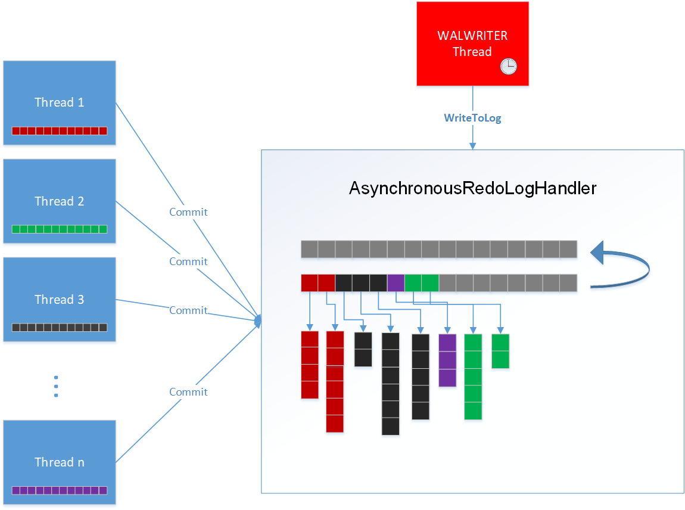
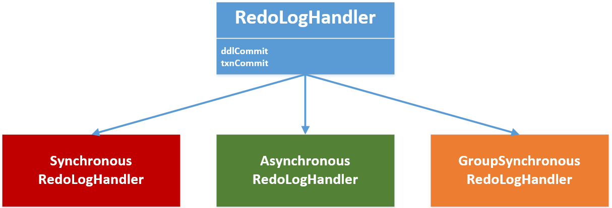

# Asynchronous Redo Logging

The  **Asynchronous Redo Logging**  option is the fastest logging method, However, it does not ensure no data loss, meaning that some data that is still in the buffer and was not yet written to disk may get lost upon a power failure or database crash. When a transaction is committed by a client application, the transaction redo entries are recorded in internal buffers and written to disk at preconfigured intervals. The client application does not wait for the data being written to disk. It continues to the next transaction. This is what makes asynchronous redo logging the fastest logging method.

When a transaction is committed by a client application, the transaction redo entries are recorded in the WAL Redo Log, as follows –

1.  While a transaction is in progress, it is stored in the MOT's memory.
2.  After a transaction finishes and the client application sends a Commit command, the transaction redo entries are written to internal buffers, but are not yet written to disk. Then changes to the MOT data memory take place and the client application is notified that the transaction is committed.
3.  At a preconfigured interval, a redo log thread running in the background collects all the buffered redo log entries and writes them to disk.

## **Technical Description**

Upon transaction commit, the transaction buffer is moved \(pointer assignment – not a data copy\) to a centralized buffer and a new transaction buffer is allocated for the transaction. The transaction is released as soon as its buffer is moved to the centralized buffer and the transaction thread is not blocked. The actual write to the log uses the Postgres walwriter thread. When the walwriter timer elapses, it first calls the AsynchronousRedoLogHandler \(via registered callback\) to write its buffers and then continues with its logic and flushes the data to the XLOG.

**Figure  1**  Asynchronous Logging

## **Summary**

The Asynchronous Redo Logging option is the fastest logging option because it does not require the client application to wait for data being written to disk. In addition, it groups many transactions redo entries and writes them together, thus reducing the amount of disk I/Os that slow down the MOT engine.

The downside of the Asynchronous Redo Logging option is that it does not ensure that data will not get lost upon a crash or failure. Data that was committed, but was not yet written to disk, is not durable on commit and thus cannot be recovered in case of a failure. The Asynchronous Redo Logging option is most relevant for applications that are willing to sacrifice data recovery \(consistency\) over performance.

Logging Design Details

The following describes the design details of each persistence-related component in the In-Memory Engine Module.

**Figure  2**  Three Logging Options

The RedoLog component is used by both by backend threads that use the In-Memory Engine and by the WAL writer in order to persist their data. Checkpoints are performed using the Checkpoint Manager, which is triggered by the Postgres checkpointer.

