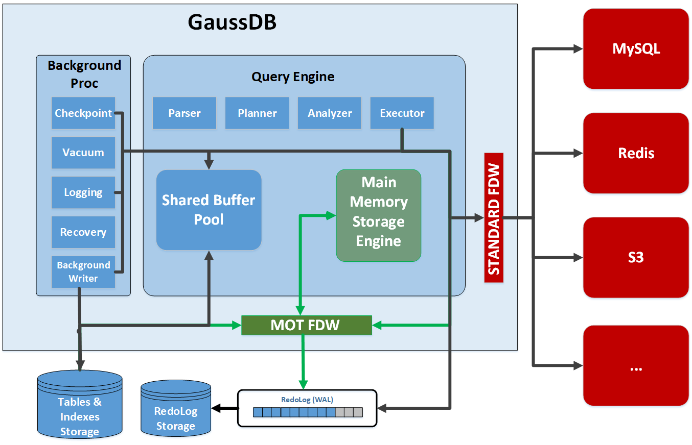

# Extended FDW and other GaussDB features 

GaussDB is based on PostgreSQL, which does not have a built-in storage engine adapter such as MySQL handlerton. To enable MOT storage engine integration into GaussDB we decided to make use and extend the existing Foreign Data Wrapper \(FDW\) mechanism.

With FDW introduction into PostgreSQL 9.1, an access to externally managed databases become possible, with presentation of foreign tables or data source unites as locally accessible relations.

On the contrary, MOT storage engine is embedded inside GaussDB and its tables are managed by it. Access to tables are controller by GaussDB planner and executor, MOT gets logging and checkpointing services from the GaussDB, and participates in the recovery process of the GaussDB and more processes. We refer to all the components in use or accessing MOT storage engine as the “Envelope”.

The figure bellow demonstrates MOT storage engine embedment and bi-directional access to database functionality.

We have broaden the FDW capabilities by extending and modifying the FdwRoutine structure. Support for new features was added, such as Add index, Drop index/table, Truncate, Vacuum and Table/Index Memory Statistics. A significant emphasis was done on integration with GaussDB logging, replication and checkpointing mechanisms, to provide consistency for cross-table transactions through failures. In this case, the MOT itself sometimes initiates calls to GaussDB functionality through the FDW layer. Such calls were never required previous to MOT introduction.

## Tables and Indexes creation

To support MOT tables creation the standard FDW syntax was reused: create FOREIGN table. In MOT case, the MOT FDW mechanism passes the instruction to MOT storage engine for actual table creation. Similarly we needed ability to support index creation \(create index …\), previously not available and unneeded in FDW, since its tables are managed externally.

To support both, in the MOT FDW function ValidateTableDef actually creates the specified table, and in addition it handles index creation on that relation and DROP TABLE and DROP INDEX, as well as VACUUM and ALTER TABLE, which also previously were not supported in FDW.

## Index Usage for Planning and Execution

Query life breaks into two phases, the planning and the execution. In the planning phase, which may take place once per multiple executions, the best index for the scan is chosen. The choice is made based on matching query’s WHERE clauses, JOIN clauses, and ORDER BY conditions. During execution a query iterates on the relevant table rows, and performs some work, e.g., update or delete, per iteration. An insert is a special case where the table adds the row to all indexes and no scanning is required.

Planner: In the standard FDW the query is passed for execution to a foreign data source, thus indexes filtering and actual planning, i.e. choice of indexes, is not done locally in the database, rather in the external data source. Internally the FDW returns to the database planner a general plan. In case of MOT tables, similarly as for database Disk-tables, relevant MOT indexes are filtered, matched, and the one that will minimize the set of traversed rows is selected and added the plan.

Executor: The query execution is using the chosen MOT index for iteration over the relevant rows of the table. Each row is inspected by GaussDB envelope, and according to the query conditions, an update or delete is called for it.

## Durability and HA

While a storage engine is responsible to store, read, update and delete data in the underlying memory and storage systems. The Logging, checkpointing and recovery are not parts of the storage engine, especially as some transactions encompass multiple tables with different storage engines. Thus, to persist and replicate the data we use the high-availability facilities from the GaussDB envelope as follows:

Logging: To ensure Durability, the MOT persists data by write-ahead logging \(WAL\) records using the GaussDB’s XLOG interface. By doing that we also gain GaussDB’s replication capabilities that are using the same APIs.

Checkpointing: MOT checkpoint is enabled by registering a callback to GaussDB’s checkpointer. Whenever a general database checkpoint is performed, the MOT checkpoint process is called as well. MOT keeps the checkpoint’s LSN \(Log Sequence Number\) in order to be aligned with GaussDB’s recovery. The MOT checkpointing algorithm highly optimized, asynchronous and is not stopping concurrent transactions. More information on the matter can be found in section  [CHECKPOINT](checkpoint.md#EN-US_TOPIC_0257867367). 

Recovery: Upon startup, GaussDB first calls an MOT callback that first recovers the MOT checkpoint by loading into memory rows and creating indexes, followed by execution of the WAL recovery by replaying records according to the checkpoint’s LSN. MOT checkpoint is recovered in parallel using multiple threads, each one reading a different data segment. This makes MOT checkpoint recovery quite fast on many-core hardware, though still potentially slower compared to disk-based tables where only WAL records are replayed.

## VACUUM and DROP

To complete the functionality of MOT we added support for VACUUM, DROP TABLE, and DROP INDEX. All three execute with exclusive table lock, i.e. without concurrent transactions on the table. The system VACUUM calls a new FDW function to perform the MOT vacuuming, while DROP was added to the ValidateTableDef\(\) function.

Deleting memory pools: Each index and table tracks all memory pools it uses. At DROP INDEX command its metadata is removed and memory pools are deleted as one consecutive block. The MOT VACUUM is only doing compaction of the used memory, as memory reclamation is done continuously in the background by the epoch based Garbage Collector \(GC\). To perform the compaction we switch the index or the table to new memory pools, traverse all the live data, delete each row and insert it using the new pools, and finally delete the pools as done for drop.

## Query Native Compilation \(JIT\)

The FDW adapter to MOT engine also contains a lite execution path that employs Just-In-Time \(JIT\) compiled query execution using the LLVM compiler. More information about MOT Query Native Compilation or can be found in section  **ConceptsàQuery Native Compilation \(JIT\)**.

