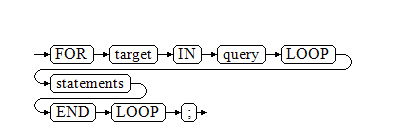

# Loop Statements<a name="EN-US_TOPIC_0289900479"></a>

## Simple LOOP Statements<a name="en-us_topic_0283137274_en-us_topic_0237122234_en-us_topic_0059778638_s27557775f6014d78b9a100c65a4cbb41"></a>

**Syntax diagram**

**Figure  1**  loop::=<a name="en-us_topic_0283137274_en-us_topic_0237122234_en-us_topic_0059778638_fa21272428ed842298772423d38c5cc4b"></a>  


**Example**

```
CREATE OR REPLACE PROCEDURE proc_loop(i in integer, count out integer) 
AS 
    BEGIN 
        count:=0; 
        LOOP 
        IF count > i THEN 
            raise info 'count is %. ', count;  
            EXIT; 
        ELSE 
            count:=count+1; 
        END IF; 
        END LOOP; 
    END;
/

CALL proc_loop(10,5);
```

> **NOTICE:** 
>The loop must be exploited together with  **EXIT**; otherwise, a dead loop occurs.

## WHILE\_LOOP Statements<a name="en-us_topic_0283137274_en-us_topic_0237122234_en-us_topic_0059778638_s14510a113df844eaa0b7e00aa2868313"></a>

**Syntax diagram**

**Figure  2**  while\_loop::=<a name="en-us_topic_0283137274_en-us_topic_0237122234_en-us_topic_0059778638_fc93167bb5ad54010979321d4e0fdbd55"></a>  


If the conditional expression is true, a series of statements in the WHILE statement are repeatedly executed and the condition is decided each time the loop body is executed.

**Example**

```
CREATE TABLE integertable(c1 integer) ; 
CREATE OR REPLACE PROCEDURE proc_while_loop(maxval in integer) 
AS 
    DECLARE 
    i int :=1;  
    BEGIN 
        WHILE i < maxval LOOP 
            INSERT INTO integertable VALUES(i); 
            i:=i+1; 
        END LOOP; 
    END; 
/

-- Invoke a function.
CALL proc_while_loop(10);

-- Delete the stored procedure and table.
DROP PROCEDURE proc_while_loop;
DROP TABLE integertable;
```

## FOR\_LOOP \(_Integer variable_\)  _Statement_<a name="en-us_topic_0283137274_en-us_topic_0237122234_en-us_topic_0059778638_s8d545e0d7dc542958236a07d6c428df3"></a>

**Syntax diagram**

**Figure  3**  for\_loop::=<a name="en-us_topic_0283137274_en-us_topic_0237122234_en-us_topic_0059778638_f225dca3e3bb8473198031bfc2a49f3e1"></a>  


> **NOTE:** 
>-   The variable  _name_  is automatically defined as the integer type and exists only in this loop. The value of  _name_  ranges from  **lower\_bound**  to  **upper\_bound**.
>-   When the keyword  **REVERSE**  is used, the value of  **lower\_bound**  must be greater than or equal to that of  **upper\_bound**; otherwise, the loop body is not executed.

## FOR\_LOOP Query Statements<a name="en-us_topic_0283137274_en-us_topic_0237122234_en-us_topic_0059778638_s93d5c1ba93874e4496553a9e1e840476"></a>

**Syntax diagram**

**Figure  4**  for\_loop\_query::=<a name="en-us_topic_0283137274_en-us_topic_0237122234_en-us_topic_0059778638_f4043c6dc0195466388bb2b9b42874e52"></a>  


> **NOTE:** 
>The variable  _target_  is automatically defined, its type is the same as that in the query result, and it is valid only in this loop. The value of  _target_  is the query result.

## FORALL Batch Query Statements<a name="en-us_topic_0283137274_en-us_topic_0237122234_en-us_topic_0059778638_sfb1cf79f590142f19c106d6c9a9e700b"></a>

**Syntax diagram**

**Figure  5**  forall::=<a name="fig1638718526215"></a>  


> **NOTE:** 
>-   The variable  _index_  is automatically defined as the integer type and exists only in this loop. The value of  _index_  falls between the value of  **low\_bound**  and the value of  **upper\_bound**.
>-   If  **SAVE EXCEPTIONS**  is specified, exceptions occurred during DML execution in the loop body are saved in  **SQL&BULK\_EXCEPTIONS**  and an exception is thrown after the execution is complete. If there is no abnormal execution result in the loop, the loop will not be rolled back in the current subtransaction.

**Example**

```
CREATE TABLE hdfs_t1 (
  title NUMBER(6),
  did VARCHAR2(20),
  data_period VARCHAR2(25),
  kind VARCHAR2(25),
  interval VARCHAR2(20),
  time DATE,
  isModified VARCHAR2(10)
);

INSERT INTO hdfs_t1 VALUES( 8, 'Donald', 'OConnell', 'DOCONNEL', '650.507.9833', to_date('21-06-1999', 'dd-mm-yyyy'), 'SH_CLERK' );

CREATE OR REPLACE PROCEDURE proc_forall()
AS 
BEGIN 
    FORALL i IN 100..120 
        update hdfs_t1 set title = title + 100*i;
END; 
/

-- Invoke a function.
CALL proc_forall();

-- Query the invocation result of the stored procedure.
SELECT * FROM hdfs_t1 WHERE title BETWEEN 100 AND 120;

-- Delete the stored procedure and table.
DROP PROCEDURE proc_forall;
DROP TABLE hdfs_t1;
```

