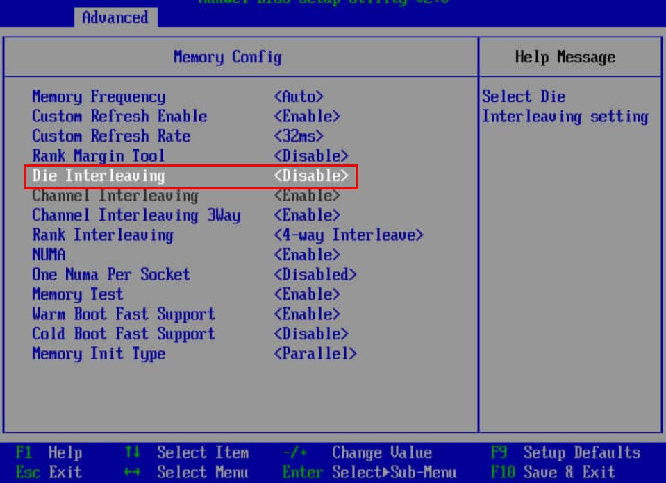
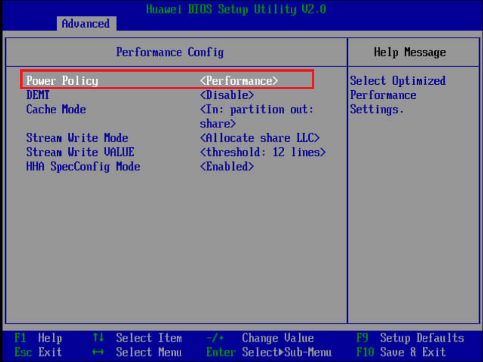

# MOT Server Optimization – ARM Huawei Taishan 2P/4P<a name="EN-US_TOPIC_0270171568"></a>

The following are optional settings for optimizing MOT database performance running on an ARM/Kunpeng-based Huawei Taishan 2280 v2 server powered by 2-sockets with a total of 256 Cores<sup>\[</sup><sup>[Comparison – Disk vs. MOT](comparison-disk-vs-mot.md)</sup><sup>\]</sup>  and Taishan 2480 v2 server powered by 4-sockets with a total of 256 Cores<sup>\[</sup>[Comparison – Disk vs. MOT](comparison-disk-vs-mot.md)<sup>\]</sup>.

Unless indicated otherwise, the following settings are for both client and server machines –

## BIOS<a name="section191581414102218"></a>

Modify related BIOS settings, as follows –

1.  Select  **BIOS**  -- **Advanced**  -- **MISC Config**. Set  **Support Smmu**  to  **Disabled**.
2.  Select  **BIOS**  --  **Advanced**  --  **MISC Config**. Set  **CPU Prefetching Configuration**  to  **Disabled**.

    

3.  Select  **BIOS**  -- **Advanced**  --  **Memory Config**. Set  **Die Interleaving**  to  **Disabled**.

    

4.  Select  **BIOS**  --  **Advanced**  -- **Performance Config**. Set  **Power Policy**  to  **Performance**.

    


## OS – Kernel and Boot<a name="section5765175572217"></a>

-   The following operating system kernel and boot parameters are usually configured by a sysadmin.

    Configure the kernel parameters, as follows –

    ```
    net.ipv4.ip_local_port_range = 9000 65535
    kernel.sysrq = 1
    kernel.panic_on_oops = 1
    kernel.panic = 5
    kernel.hung_task_timeout_secs = 3600
    kernel.hung_task_panic = 1
    vm.oom_dump_tasks = 1
    kernel.softlockup_panic = 1
    fs.file-max = 640000
    kernel.msgmnb = 7000000
    kernel.sched_min_granularity_ns = 10000000
    kernel.sched_wakeup_granularity_ns = 15000000
    kernel.numa_balancing=0
    vm.max_map_count = 1048576
    net.ipv4.tcp_max_tw_buckets = 10000
    net.ipv4.tcp_tw_reuse = 1
    net.ipv4.tcp_tw_recycle = 1
    net.ipv4.tcp_keepalive_time = 30
    net.ipv4.tcp_keepalive_probes = 9
    net.ipv4.tcp_keepalive_intvl = 30
    net.ipv4.tcp_retries2 = 80
    kernel.sem = 32000 1024000000      500     32000
    kernel.shmall = 52805669
    kernel.shmmax = 18446744073692774399
    sys.fs.file-max = 6536438
    net.core.wmem_max = 21299200
    net.core.rmem_max = 21299200
    net.core.wmem_default = 21299200
    net.core.rmem_default = 21299200
    net.ipv4.tcp_rmem = 8192 250000 16777216
    net.ipv4.tcp_wmem = 8192 250000 16777216
    net.core.somaxconn = 65535
    vm.min_free_kbytes = 5270325
    net.core.netdev_max_backlog = 65535
    net.ipv4.tcp_max_syn_backlog = 65535
    net.ipv4.tcp_syncookies = 1
    vm.overcommit_memory = 0
    net.ipv4.tcp_retries1 = 5
    net.ipv4.tcp_syn_retries = 5
    ##NEW
    kernel.sched_autogroup_enabled=0
    kernel.sched_min_granularity_ns=2000000
    kernel.sched_latency_ns=10000000
    kernel.sched_wakeup_granularity_ns=5000000
    kernel.sched_migration_cost_ns=500000
    vm.dirty_background_bytes=33554432
    kernel.shmmax=21474836480
    net.ipv4.tcp_timestamps = 0
    net.ipv6.conf.all.disable_ipv6=1
    net.ipv6.conf.default.disable_ipv6=1
    net.ipv4.tcp_keepalive_time=600
    net.ipv4.tcp_keepalive_probes=3
    kernel.core_uses_pid=1
    ```


-   Tuned Service

    The following section is mandatory.

    The server must run a throughput-performance profile –

    ```
    [...]$ tuned-adm profile throughput-performance
    ```

    The  **throughput-performance**  profile is broadly applicable tuning that provides excellent performance across a variety of common server workloads.

    Other less suitable profiles for openGauss and MOT server that may affect MOT's overall performance are – balanced, desktop, latency-performance, network-latency, network-throughput and powersave.

-   Boot Tuning

    Add  **iommu.passthrough=1**  to the  **kernel boot arguments**.

    When operating in  **pass-through**  mode, the adapter does require  **DMA translation to the memory,**  which improves performance.


