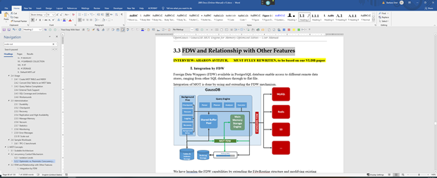
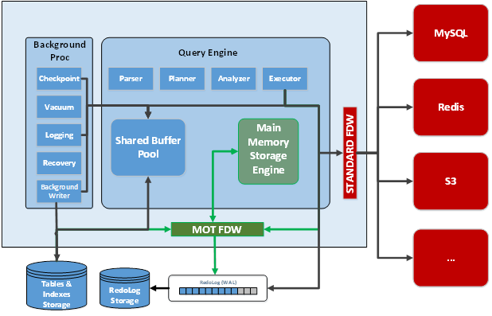

# OCC vs 2PL differences by example<a name="EN-US_TOPIC_0257867430"></a>

The following shows the differences between two different user experiences – Pessimistic \(such as disk-based tables\) and Optimistic \(MOT tables\) when sessions update the same table simultaneously.

In this example, the following table test command is run –

```
table “TEST” – create  table test (x int, y int, z int, primary key(x));
```

This example describes two aspects of the test, user experience \(operations in the example\) and retry requirement.

## Pessimistic Approach – Used in Disk-based Tables<a name="en-us_topic_0257713300_section5143141113412"></a>

The following is an example of the Pessimistic approach \(which is not Mot\). Any Isolation Level may apply.

The following two sessions perform a transaction with an attempt to update a single table.

A WAIT LOCK action occurs and the client experience is that session \#2 is  _stuck_  until Session \#1 finished a COMMIT. Only afterwards, Session \#2 can progress.

However, in this approach, both sessions succeed and there is no abort \(unless SERIALIZABLE or REPEATABLE-READ isolation level is applied\) and then the entire transaction must be retried.

**Table  1**  Pessimistic Approach Code Example

<a name="en-us_topic_0257713300_table47044503"></a>
<table><thead align="left"><tr id="en-us_topic_0257713300_row24653180"><th class="cellrowborder" valign="top" width="5.1005100510051%" id="mcps1.2.4.1.1">&nbsp;&nbsp;</th>
<th class="cellrowborder" valign="top" width="32.653265326532654%" id="mcps1.2.4.1.2"><p id="en-us_topic_0257713300_p17157596"><a name="en-us_topic_0257713300_p17157596"></a><a name="en-us_topic_0257713300_p17157596"></a>Session 1</p>
</th>
<th class="cellrowborder" valign="top" width="62.24622462246224%" id="mcps1.2.4.1.3"><p id="en-us_topic_0257713300_p47588012"><a name="en-us_topic_0257713300_p47588012"></a><a name="en-us_topic_0257713300_p47588012"></a>Session 2</p>
</th>
</tr>
</thead>
<tbody><tr id="en-us_topic_0257713300_row29423773"><td class="cellrowborder" valign="top" width="5.1005100510051%" headers="mcps1.2.4.1.1 "><p id="en-us_topic_0257713300_p34515414"><a name="en-us_topic_0257713300_p34515414"></a><a name="en-us_topic_0257713300_p34515414"></a>t0</p>
</td>
<td class="cellrowborder" valign="top" width="32.653265326532654%" headers="mcps1.2.4.1.2 "><p id="en-us_topic_0257713300_p44285184"><a name="en-us_topic_0257713300_p44285184"></a><a name="en-us_topic_0257713300_p44285184"></a>Begin</p>
</td>
<td class="cellrowborder" valign="top" width="62.24622462246224%" headers="mcps1.2.4.1.3 "><p id="en-us_topic_0257713300_p30330179"><a name="en-us_topic_0257713300_p30330179"></a><a name="en-us_topic_0257713300_p30330179"></a>Begin</p>
</td>
</tr>
<tr id="en-us_topic_0257713300_row4536157"><td class="cellrowborder" valign="top" width="5.1005100510051%" headers="mcps1.2.4.1.1 "><p id="en-us_topic_0257713300_p31884407"><a name="en-us_topic_0257713300_p31884407"></a><a name="en-us_topic_0257713300_p31884407"></a>t1</p>
</td>
<td class="cellrowborder" valign="top" width="32.653265326532654%" headers="mcps1.2.4.1.2 "><p id="en-us_topic_0257713300_p32500157"><a name="en-us_topic_0257713300_p32500157"></a><a name="en-us_topic_0257713300_p32500157"></a>update test set y=200 where x=1;</p>
</td>
<td class="cellrowborder" valign="top" width="62.24622462246224%" headers="mcps1.2.4.1.3 ">&nbsp;&nbsp;</td>
</tr>
<tr id="en-us_topic_0257713300_row3186145"><td class="cellrowborder" valign="top" width="5.1005100510051%" headers="mcps1.2.4.1.1 "><p id="en-us_topic_0257713300_p56751222"><a name="en-us_topic_0257713300_p56751222"></a><a name="en-us_topic_0257713300_p56751222"></a>t2</p>
</td>
<td class="cellrowborder" valign="top" width="32.653265326532654%" headers="mcps1.2.4.1.2 "><p id="en-us_topic_0257713300_p33446292"><a name="en-us_topic_0257713300_p33446292"></a><a name="en-us_topic_0257713300_p33446292"></a>y=200</p>
</td>
<td class="cellrowborder" valign="top" width="62.24622462246224%" headers="mcps1.2.4.1.3 "><p id="en-us_topic_0257713300_p24795106"><a name="en-us_topic_0257713300_p24795106"></a><a name="en-us_topic_0257713300_p24795106"></a>Update test set y=300 where x=1; -- Wait on lock</p>
</td>
</tr>
<tr id="en-us_topic_0257713300_row21829362"><td class="cellrowborder" valign="top" width="5.1005100510051%" headers="mcps1.2.4.1.1 "><p id="en-us_topic_0257713300_p23347916"><a name="en-us_topic_0257713300_p23347916"></a><a name="en-us_topic_0257713300_p23347916"></a>t4</p>
</td>
<td class="cellrowborder" valign="top" width="32.653265326532654%" headers="mcps1.2.4.1.2 "><p id="en-us_topic_0257713300_p12133034"><a name="en-us_topic_0257713300_p12133034"></a><a name="en-us_topic_0257713300_p12133034"></a>Commit</p>
</td>
<td class="cellrowborder" valign="top" width="62.24622462246224%" headers="mcps1.2.4.1.3 ">&nbsp;&nbsp;</td>
</tr>
<tr id="en-us_topic_0257713300_row53720990"><td class="cellrowborder" valign="top" width="5.1005100510051%" headers="mcps1.2.4.1.1 ">&nbsp;&nbsp;</td>
<td class="cellrowborder" valign="top" width="32.653265326532654%" headers="mcps1.2.4.1.2 ">&nbsp;&nbsp;</td>
<td class="cellrowborder" valign="top" width="62.24622462246224%" headers="mcps1.2.4.1.3 "><p id="en-us_topic_0257713300_p16989553"><a name="en-us_topic_0257713300_p16989553"></a><a name="en-us_topic_0257713300_p16989553"></a>Unlock</p>
</td>
</tr>
<tr id="en-us_topic_0257713300_row18688252"><td class="cellrowborder" valign="top" width="5.1005100510051%" headers="mcps1.2.4.1.1 ">&nbsp;&nbsp;</td>
<td class="cellrowborder" valign="top" width="32.653265326532654%" headers="mcps1.2.4.1.2 ">&nbsp;&nbsp;</td>
<td class="cellrowborder" valign="top" width="62.24622462246224%" headers="mcps1.2.4.1.3 "><p id="en-us_topic_0257713300_p61654013"><a name="en-us_topic_0257713300_p61654013"></a><a name="en-us_topic_0257713300_p61654013"></a>Commit</p>
<p id="en-us_topic_0257713300_p18015212"><a name="en-us_topic_0257713300_p18015212"></a><a name="en-us_topic_0257713300_p18015212"></a>(in READ-COMMITTED this will succeed, in SERIALIZABLE it will fail)</p>
</td>
</tr>
<tr id="en-us_topic_0257713300_row27919180"><td class="cellrowborder" valign="top" width="5.1005100510051%" headers="mcps1.2.4.1.1 ">&nbsp;&nbsp;</td>
<td class="cellrowborder" valign="top" width="32.653265326532654%" headers="mcps1.2.4.1.2 ">&nbsp;&nbsp;</td>
<td class="cellrowborder" valign="top" width="62.24622462246224%" headers="mcps1.2.4.1.3 "><p id="en-us_topic_0257713300_p29994707"><a name="en-us_topic_0257713300_p29994707"></a><a name="en-us_topic_0257713300_p29994707"></a>y = 300</p>
</td>
</tr>
</tbody>
</table>

## Optimistic Approach – Used in MOT<a name="en-us_topic_0257713300_section6969391364"></a>

The following is an example of the Optimistic approach.

It describes the situation of creating a MOT table4 and then having two concurrent sessions updating that same MOT table simultaneously –

```
create foreign table test (x int, y int, z int, primary key(x));
```

-   The advantage and user experience of OCC is that there are no locks until COMMIT.
-   The disadvantage of using OCC is that the update may fail if another session updates the same record. If the update fails \(in all supported isolation levels\), an entire SESSION \#2 transaction must be retried.
-   Update conflicts are detected by the kernel at commit time by using a version checking mechanism.
-   SESSION \#2 will not wait in its update operation and will be aborted because of conflict detection at commit phase.

**Table  2**  Optimistic Approach Code Example – Used in MO

<a name="en-us_topic_0257713300_table26183426"></a>
<table><thead align="left"><tr id="en-us_topic_0257713300_row57296493"><th class="cellrowborder" valign="top" width="11.219999999999999%" id="mcps1.2.4.1.1">&nbsp;&nbsp;</th>
<th class="cellrowborder" valign="top" width="41.839999999999996%" id="mcps1.2.4.1.2"><p id="en-us_topic_0257713300_p45545987"><a name="en-us_topic_0257713300_p45545987"></a><a name="en-us_topic_0257713300_p45545987"></a>Session 1</p>
</th>
<th class="cellrowborder" valign="top" width="46.94%" id="mcps1.2.4.1.3"><p id="en-us_topic_0257713300_p65346308"><a name="en-us_topic_0257713300_p65346308"></a><a name="en-us_topic_0257713300_p65346308"></a>Session 2</p>
</th>
</tr>
</thead>
<tbody><tr id="en-us_topic_0257713300_row58559627"><td class="cellrowborder" valign="top" width="11.219999999999999%" headers="mcps1.2.4.1.1 "><p id="en-us_topic_0257713300_p45709309"><a name="en-us_topic_0257713300_p45709309"></a><a name="en-us_topic_0257713300_p45709309"></a>t0</p>
</td>
<td class="cellrowborder" valign="top" width="41.839999999999996%" headers="mcps1.2.4.1.2 "><p id="en-us_topic_0257713300_p11466564"><a name="en-us_topic_0257713300_p11466564"></a><a name="en-us_topic_0257713300_p11466564"></a>Begin</p>
</td>
<td class="cellrowborder" valign="top" width="46.94%" headers="mcps1.2.4.1.3 "><p id="en-us_topic_0257713300_p56376520"><a name="en-us_topic_0257713300_p56376520"></a><a name="en-us_topic_0257713300_p56376520"></a>Begin</p>
</td>
</tr>
<tr id="en-us_topic_0257713300_row37626636"><td class="cellrowborder" valign="top" width="11.219999999999999%" headers="mcps1.2.4.1.1 "><p id="en-us_topic_0257713300_p27858677"><a name="en-us_topic_0257713300_p27858677"></a><a name="en-us_topic_0257713300_p27858677"></a>t1</p>
</td>
<td class="cellrowborder" valign="top" width="41.839999999999996%" headers="mcps1.2.4.1.2 "><p id="en-us_topic_0257713300_p41960399"><a name="en-us_topic_0257713300_p41960399"></a><a name="en-us_topic_0257713300_p41960399"></a>update test set y=200 where x=1;</p>
</td>
<td class="cellrowborder" valign="top" width="46.94%" headers="mcps1.2.4.1.3 ">&nbsp;&nbsp;</td>
</tr>
<tr id="en-us_topic_0257713300_row54598356"><td class="cellrowborder" valign="top" width="11.219999999999999%" headers="mcps1.2.4.1.1 "><p id="en-us_topic_0257713300_p60390686"><a name="en-us_topic_0257713300_p60390686"></a><a name="en-us_topic_0257713300_p60390686"></a>t2</p>
</td>
<td class="cellrowborder" valign="top" width="41.839999999999996%" headers="mcps1.2.4.1.2 "><p id="en-us_topic_0257713300_p59807380"><a name="en-us_topic_0257713300_p59807380"></a><a name="en-us_topic_0257713300_p59807380"></a>y=200</p>
</td>
<td class="cellrowborder" valign="top" width="46.94%" headers="mcps1.2.4.1.3 "><p id="en-us_topic_0257713300_p12559648"><a name="en-us_topic_0257713300_p12559648"></a><a name="en-us_topic_0257713300_p12559648"></a>Update test set y=300 where x=1;</p>
</td>
</tr>
<tr id="en-us_topic_0257713300_row45927968"><td class="cellrowborder" valign="top" width="11.219999999999999%" headers="mcps1.2.4.1.1 "><p id="en-us_topic_0257713300_p29177957"><a name="en-us_topic_0257713300_p29177957"></a><a name="en-us_topic_0257713300_p29177957"></a>t4</p>
</td>
<td class="cellrowborder" valign="top" width="41.839999999999996%" headers="mcps1.2.4.1.2 "><p id="en-us_topic_0257713300_p14604339"><a name="en-us_topic_0257713300_p14604339"></a><a name="en-us_topic_0257713300_p14604339"></a>Commit</p>
</td>
<td class="cellrowborder" valign="top" width="46.94%" headers="mcps1.2.4.1.3 "><p id="en-us_topic_0257713300_p42100785"><a name="en-us_topic_0257713300_p42100785"></a><a name="en-us_topic_0257713300_p42100785"></a>y = 300</p>
</td>
</tr>
<tr id="en-us_topic_0257713300_row43362745"><td class="cellrowborder" valign="top" width="11.219999999999999%" headers="mcps1.2.4.1.1 ">&nbsp;&nbsp;</td>
<td class="cellrowborder" valign="top" width="41.839999999999996%" headers="mcps1.2.4.1.2 ">&nbsp;&nbsp;</td>
<td class="cellrowborder" valign="top" width="46.94%" headers="mcps1.2.4.1.3 "><p id="en-us_topic_0257713300_p26813004"><a name="en-us_topic_0257713300_p26813004"></a><a name="en-us_topic_0257713300_p26813004"></a>Commit</p>
</td>
</tr>
<tr id="en-us_topic_0257713300_row39990445"><td class="cellrowborder" valign="top" width="11.219999999999999%" headers="mcps1.2.4.1.1 ">&nbsp;&nbsp;</td>
<td class="cellrowborder" valign="top" width="41.839999999999996%" headers="mcps1.2.4.1.2 ">&nbsp;&nbsp;</td>
<td class="cellrowborder" valign="top" width="46.94%" headers="mcps1.2.4.1.3 "><p id="en-us_topic_0257713300_p57642384"><a name="en-us_topic_0257713300_p57642384"></a><a name="en-us_topic_0257713300_p57642384"></a>ABORT</p>
</td>
</tr>
<tr id="en-us_topic_0257713300_row49019411"><td class="cellrowborder" valign="top" width="11.219999999999999%" headers="mcps1.2.4.1.1 ">&nbsp;&nbsp;</td>
<td class="cellrowborder" valign="top" width="41.839999999999996%" headers="mcps1.2.4.1.2 ">&nbsp;&nbsp;</td>
<td class="cellrowborder" valign="top" width="46.94%" headers="mcps1.2.4.1.3 "><p id="en-us_topic_0257713300_p2426788"><a name="en-us_topic_0257713300_p2426788"></a><a name="en-us_topic_0257713300_p2426788"></a>y = 200</p>
</td>
</tr>
</tbody>
</table>

**How to Retry in MOT**

The following example shows how to retry a transaction that fails due to a commit abort being detected at commit time. In disk-based tables, this may occur in transactions that use SERIALIZABLE or REPEATABLE-READ isolation leveld. In MOT, this may occur on any isolation level.

The following example is taken from TPC-C payment transaction.

```
int commitAborts = 0;
 
while (commitAborts < RETRY_LIMIT) {
                
                try {                        
                                stmt = db.stmtPaymentUpdateDistrict;
                                stmt.setDouble(1, 100);
                                stmt.setInt(2, 1);
                                stmt.setInt(3, 1);
                                stmt.executeUpdate();
 
                                db.commit();                     
                                
                                break;
                }              
                catch (SQLException se) {
                                if (se != null && se.getMessage().contains("could not serialize access due to concurrent update")) {
                                                log.error("commmit abort = " + se.getMessage());
                                                commitAborts++;
                                                continue;
                                } else {
                                                db.rollback();
                                }
                                
                                break;
                }
 
}

```



## Seamless Integration of MOT with GaussDB<a name="en-us_topic_0257713300_section17397917174412"></a>

MOT is a high-performance memory-optimized storage engine that is pluggable into a GaussDB envelop. It benefits from SQL and HA capabilities, and enables high‑interoperability side-by-side with the disk-based row-store engine. The result – best tpc-c performance in a production-grade database.

The following shows the Memory Optimized Storage Engine component with GaussDB, which is responsible for managing the MOT tables and transactions. Seamlessly integrated into GaussDB, the MOT utilizes its infrastructure with clear separation of components, well-defined APIs and callbacks.

**Figure  1**  Integrating the MOT Engine<a name="en-us_topic_0257713300_fig1388517322461"></a>  


