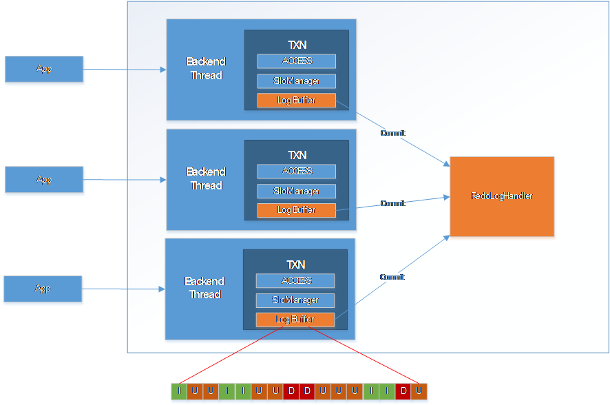
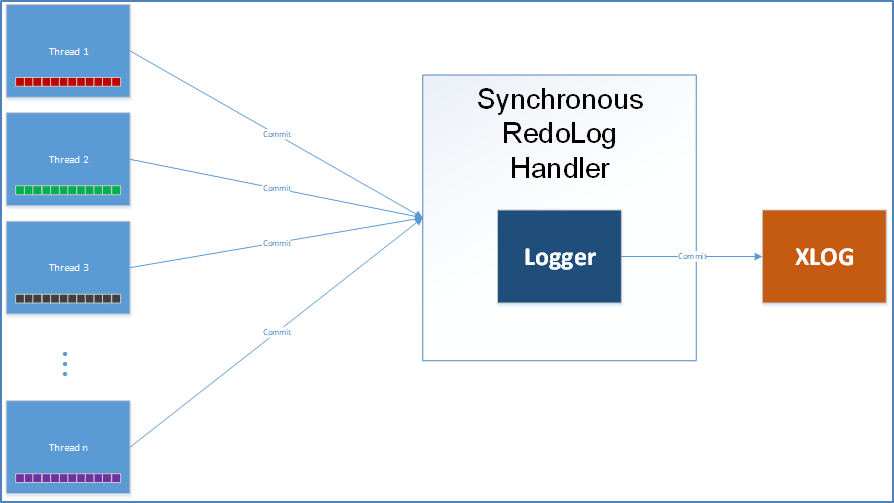
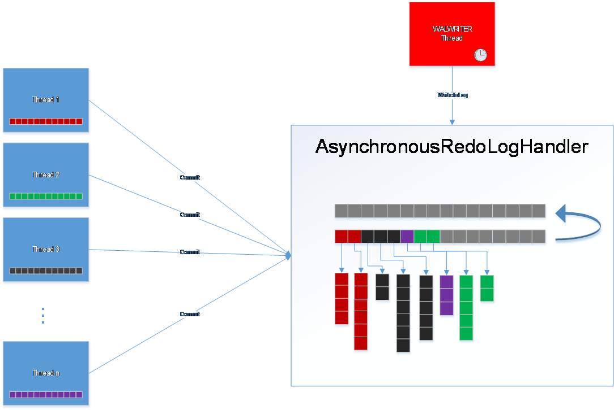
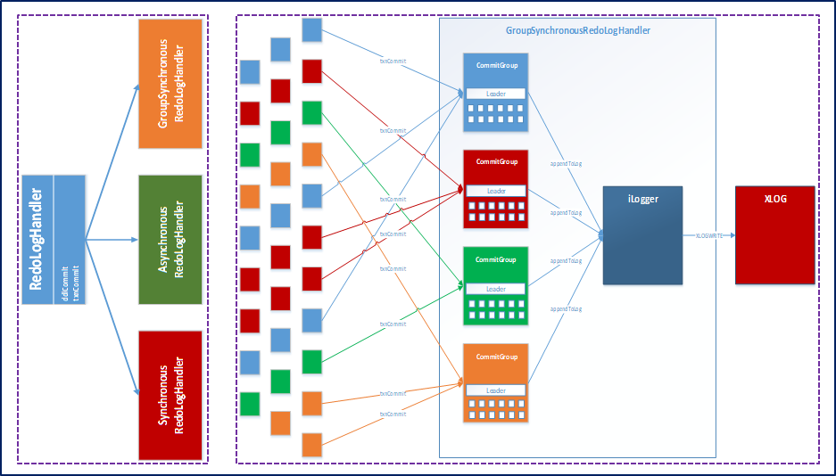

# Overall Architecture

As this diagram depicts, the RedoLog component is being used by both by backend threads which use the In-Memory Engine and by the WAL writer to persist their data.

Checkpoints are being performed using the Checkpoint Manager \(triggered by the postgres checkpointer\)

## Logging overview

Write-Ahead Logging \(WAL\) is a standard method for ensuring data durability. WAL's central concept is that changes to data files \(where tables and indexes reside\) must be written only after those changes have been logged, that is, after log records describing the changes have been flushed to permanent storage.

In the In-Memory Engine we have made the decision to use the existing openGauss logging facilities and not develop a low level logging API from scratch in order to reduce development time and to be able to use it for replication purposes as well.

## Per-transaction logging

In the In-Memory Engine, the transaction log records are stored in a transaction buffer which is part of the whole transaction object \(TXN\). The transaction buffer is logged during the calls to addToLog\(\) – if the buffer exceeds a threshold it will be flushed and reused. When a transaction commits and passes the validation phase \(OCC SILO validation\) or abort for some reason, the appropriate message will be saved in the log as well in order to make it possible to distinguish the transaction state when doing a recovery.

Parallel Logging is done both for MOT and Disk ending.

However the MOT enhances the design with a Log-buffer per Transaction, lockless preparation, Single Log Record.

## Synchronous logging

Synchronous logging is the simplest redo logger. Ongoing or when a transaction ends, the SynchronousRedoLogHandler serializes its transaction buffer and write it to the XLOG iLogger implementation.

During the write to the log, the thread is blocked and it completes as soon as its buffer is written to the log.

## Asynchronous Logging

Upon transaction commit, the transaction buffer is moved \(pointer assignment and not data copy\) to a centralized buffer and a new transaction buffer is allocated for the transaction. The transaction is released as soon as its buffer was moved to the centralized buffer. The transaction thread is not blocked. The actual write to the log uses Postgres walwriter thread. When the walwriter timer elapses, it first calls the AsynchronousRedoLogHandler \(via registered callback\) to write its buffers and then continue with its logic and flushes the data to the XLOG.

## Group Commit – with NUMA-awareness

The four colors represent 4 NUMA nodes. Thus each NUMA node has its own memory log enabling a group commit of multiple connections. This enables ….

