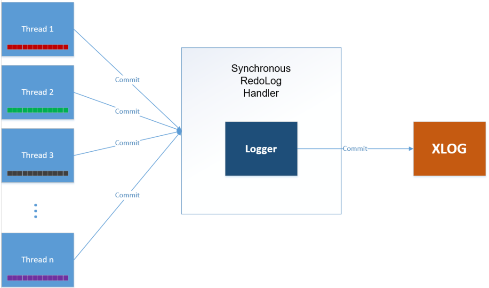

# Synchronous Redo Logging

The  **Synchronous Redo Logging**  option is the simplest and most strict redo logger. When a transaction is committed by a client application, the transaction redo entries are recorded in the WAL \(Redo Log\), as follows –

1.  While a transaction is in progress, it is stored in the MOT’s memory.
2.  After a transaction finishes and the client application sends a **Commit** command, the transaction is locked and then written to the WAL Redo Log on the disk. This means that while the transaction log entries are being written to the log, the client application is still waiting for a response.
3.  As soon as the transaction's entire buffer is written to the log, the changes to the data in memory take place and then the transaction is committed. After the transaction has been committed, the client application is notified that the transaction is complete.

**Technical Description**

When a transaction ends, the SynchronousRedoLogHandler serializes its transaction buffer and write it to the XLOG iLogger implementation.

**Figure  1**  Synchronous Logging

**Summary**

The  **Synchronous Redo Logging**  option is the safest and most strict because it ensures total synchronization of the client application and the WAL Redo log entries for each transaction as it is committed; thus ensuring total durability and consistency with absolutely no data loss. This logging option prevents the situation where a client application might mark a transaction as successful, when it has not yet been persisted to disk.

The downside of the  **Synchronous Redo Logging**  option is that it is the slowest logging mechanism of the three options. This is because a client application must wait until all data is written to disk and because of the frequent disk writes \(which typically slow down the database\).

