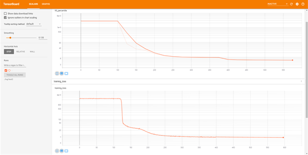

# Usage Guide<a name="EN-US_TOPIC_0243595906"></a>

## Data Collection<a name="section5640724113415"></a>

1.  Enable data collection.
    1.  Set parameters related to the ActiveSQL operator.

        ```
        enable_resource_track=on
        resource_track_level=operator
        enable_resource_record=on
        resource_track_cost=10 (The default value is 100000.)
        ```

        > **NOTE:**   
        >-   The value of  **resource\_track\_cost**  must be smaller than the total query cost of the information to be collected. Only the information that meets the requirements can be collected.  
        >-   Cgroup functions are available.  

    2.  Collect information.

        Execute the service query statement.

        View data collected in real time.

        ```
        select * from gs_wlm_plan_operator_history;
        ```

        Expected result: All jobs that meet  **resource\_track\_duration**  and  **resource\_track\_cost**  are collected.

2.  Disable data collection.
    1.  Set any of the following parameters related to the ActiveSQL operator.

        ```
        enable_resource_track=off
        resource_track_level=none
        resource_track_level=query
        ```

    2.  Execute the service query statement.

        Wait for 3 minutes and check the data on the current node.

        ```
        select * from gs_wlm_plan_operator_info;
        ```

        Expected result: No new data is added to the tables and views.

3.  Persist data.
    1.  Set parameters related to the ActiveSQL operator.

        ```
        enable_resource_track=on
        resource_track_level=operator
        enable_resource_record=on
        resource_track_duration=0 (The default value is 60s.)
        resource_track_cost=10 (The default value is 100000.)
        ```

        > **NOTE:**   
        >-   The value of  **resource\_track\_cost**  must be smaller than the total query cost of the information to be collected. Only the information that meets the requirements can be collected.  
        >-   Cgroup functions are available.  

    2.  Execute the service query statement.

        Wait for 3 minutes and check the data on the current node.

        ```
        select * from gs_wlm_plan_operator_info;
        ```

        Expected result: All jobs that meet  **resource\_track\_duration**  and  **resource\_track\_cost**  are collected.


## Model Management \(System Administrators\)<a name="section664217249345"></a>

> **NOTE:**   
>Model management operations can be performed only when the database is normal.  

1.  Add a new model.

    INSERT INTO gs\_opt\_model values\('......'\);

    Example:

    ```
    INSERT INTO gs_opt_model values('rlstm', 'model_name', 'datname', '127.0.0.1', 5000, 2000, 1, -1, 64, 512, 0 , false, false, '{S, T}', '{0,0}', '{0,0}', 'Text');
    ```

    > **NOTE:**   
    >-   For details about model parameter settings, see  [GS\_OPT\_MODEL](gs_opt_model.md).  
    >-   Currently, only  **rlstm**  is supported in the  **template\_name**  column.  
    >-   The values in the  **datname**  column must be the same as those in the database used for model usage and training. Otherwise, the model cannot be used.  
    >-   The values in the  **model\_name**  column must meet the  **unique**  constraint.  
    >-   For details about other parameter settings, see  [Best Practices](best-practices.md).  

2.  Modify model parameters.

    ```
    UPDATE gs_opt_model SET <attribute> = <value> WHERE model_name = <target_model_name>;
    ```

3.  Delete a model.

    ```
    DELETE FROM gs_opt_model WHERE model_name = <target_model_name>;
    ```

4.  Query the existing model and its status.

    ```
    SELECT * FROM gs_opt_model;
    ```


## Model Training \(System Administrators\)<a name="section1221993514546"></a>

1.  Add models and modify model parameters by following the steps in  [Model Management \(System Administrators\)](#section664217249345).

    Example:

    Add a mode.

    ```
    INSERT INTO gs_opt_model values('rlstm', 'default', 'postgres', '127.0.0.1', 5000, 2000, 1, -1, 64, 512, 0 , false, false, '{S, T}', '{0,0}', '{0,0}', 'Text');
    ```

    Modify training parameters.

    ```
    UPDATE gs_opt_model SET <attribute> = <value> WHERE model_name = <target_model_name>;
    ```

2.  Check that the database status is normal and historical data is collected properly before you perform the following operations:

    Delete the original encoding data.

    ```
    DELETE FROM gs_wlm_plan_encoding_table;
    ```

    To encode data, specify the database name.

    ```
    SELECT gather_encoding_info('postgres');
    ```

    Start training.

    ```
    SELECT model_train_opt('rlstm', 'default');
    ```

3.  View the model training status.

    ```
    SELECT * FROM track_model_train_opt('rlstm', 'default');
    ```

    The URL used by TensorBoard is returned.

    

    Access the URL to view the model training status.

    


## Model Prediction<a name="section206481548113611"></a>

> **NOTE:**   
>-   Model prediction can be performed only when the database status is normal and the specified model has been trained and converged.  
>-   Currently, the labels of model training parameters must contain the  **S**  label so that the  **p-time**  value can be displayed in  **EXPLAIN**.  
>    Example: INSERT INTO gs\_opt\_model values\('rlstm', 'default', 'postgres', '127.0.0.1', 5000, 1000, 1, -1, 50, 500, 0 , false, false, '\{**S**, T\}', '\{0,0\}', '\{0,0\}', 'Text'\);  

1.  Call EXPLAIN.

    ```
    explain (analyze on, predictor <model_name>)
    SELECT ...
    ```

    Expected result: 

    ```
    Example: Row Adapter  (cost=110481.35..110481.35 rows=100 p-time=99..182 width=100) (actual time=375.158..375.160 rows=2 loops=1)
    The p-time column indicates the predicted value of the label.
    ```


## Other Functions<a name="section1492429198"></a>

1.  Check whether the AI Engine can be connected.

    ```
    postgres=# select check_engine_status('aiEngine-ip-address',running-port);
    ```

2.  Check the path for storing model logs on the AI Engine.

    ```
    postgres=# select track_model_train_opt('template_name', 'model_name');
    ```


