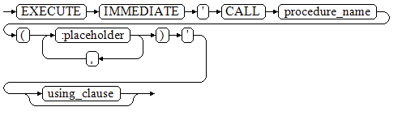

# Dynamically Calling Stored Procedures

This section describes how to dynamically call store procedures. You must use anonymous statement blocks to package stored procedures or statement blocks and append  **IN**  and  **OUT**  behind the  **EXECUTE IMMEDIATE...USING**  statement to input and output parameters.

## Syntax

[Figure 1](#en-us_topic_0237122227_en-us_topic_0059778625_f7bf3ce30f4aa42d38394f459c525f33b)  shows the syntax diagram.

**Figure  1**  call\_procedure::=  

[Figure 2](#en-us_topic_0237122227_en-us_topic_0059778625_fd82a97bfa5774a32bd19b36b80dd5248)  shows the syntax diagram for  **using\_clause**.

**Figure  2**  using\_clause::=  

The above syntax diagram is explained as follows:

-   **CALL procedure\_name**: calls the stored procedure.
-   **\[:placeholder1,:placeholder2,...\]**: specifies the placeholder list of the stored procedure parameters. The numbers of the placeholders and parameters are the same.
-   **USING \[IN|OUT|IN OUT\]bind\_argument**: specifies where the variable passed to the stored procedure parameter value is stored. The modifiers in front of  **bind\_argument**  and of the corresponding parameter are the same.

