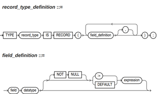

# record<a name="EN-US_TOPIC_0000001208139393"></a>

## record Variables<a name="en-us_topic_0283136936_en-us_topic_0237122215_section16992418680"></a>

Perform the following operations to create a record variable:

Define a record type and use this type to declare a variable.

## Syntax<a name="en-us_topic_0283136936_en-us_topic_0237122215_section7403195020496"></a>

For the syntax of the record type, see  [Figure 1](#en-us_topic_0283136936_en-us_topic_0237122215_fig092918316312).

**Figure  1**  Syntax of the record type<a name="en-us_topic_0283136936_en-us_topic_0237122215_fig092918316312"></a>  


The above syntax diagram is explained as follows:

-   **record\_type**: record name
-   **field**: record columns
-   **datatype**: record data type
-   **expression**: expression for setting a default value

> **NOTE:** 
>In openGauss:
>-   When assigning values to record variables, you can:
>    -   Declare a record type and define member variables of this type when you declare a function or stored procedure.
>    -   Assign the value of a record variable to another record variable.
>    -   Use  **SELECT INTO**  or  **FETCH**  to assign values to a record type.
>    -   Assign the  **NULL**  value to a record variable.
>-   The  **INSERT**  and  **UPDATE**  statements cannot use a record variable to insert or update data.
>-   Just like a variable, a record column of the compound type does not have a default value in the declaration.
>-   The data type can be the record type, array type, or set type defined in a stored procedure \(anonymous blocks are not supported\).

## Examples<a name="en-us_topic_0283136936_en-us_topic_0237122215_en-us_topic_0059778979_s471412484c0048debf8a78d76cf1a439"></a>

```
The table definition used in the following is defined as follows:
openGauss=# \d emp_rec
                Table "public.emp_rec"
  Column  |              Type              | Modifiers 
----------+--------------------------------+-----------
 empno    | numeric(4,0)                   | not null
 ename    | character varying(10)          | 
 job      | character varying(9)           | 
 mgr      | numeric(4,0)                   | 
 hiredate | timestamp(0) without time zone | 
 sal      | numeric(7,2)                   | 
 comm     | numeric(7,2)                   | 
 deptno   | numeric(2,0)                   | 

-- Perform array operations in the function.
openGauss=# CREATE OR REPLACE FUNCTION regress_record(p_w VARCHAR2)
RETURNS
VARCHAR2  AS $$
DECLARE

   -- Declare a record type.
   type rec_type is record (name  varchar2(100), epno int);
   employer rec_type;

   -- Use %type to declare the record type.
   type rec_type1 is record (name  emp_rec.ename%type, epno int not null :=10);
   employer1 rec_type1;

   -- Declare a record type with a default value.
   type rec_type2 is record (
         name varchar2 not null := 'SCOTT', 
         epno int not null :=10);
    employer2 rec_type2;
    CURSOR C1 IS  select ename,empno from emp_rec order by 1 limit 1;
            
BEGIN
      -- Assign a value to a member record variable.
     employer.name := 'WARD';
     employer.epno = 18;
     raise info 'employer name: % , epno:%', employer.name, employer.epno;

      -- Assign the value of a record variable to another variable.
     employer1 := employer;
     raise info 'employer1 name: % , epno: %',employer1.name, employer1.epno;
         
      -- Assign the NULL value to a record variable.
     employer1 := NULL;
     raise info 'employer1 name: % , epno: %',employer1.name, employer1.epno;

      -- Obtain the default value of a record variable.
     raise info 'employer2 name: % ,epno: %', employer2.name, employer2.epno;
            
      -- Use a record variable in the FOR loop.
      for employer in select ename,empno from emp_rec order by 1  limit 1 
          loop 
               raise info 'employer name: % , epno: %', employer.name, employer.epno;
          end loop;
         
      -- Use a record variable in the SELECT INTO statement.
      select ename,empno  into employer2 from emp_rec order by 1 limit 1;
      raise info 'employer name: % , epno: %', employer2.name, employer2.epno;
            
      -- Use a record variable in a cursor.
      OPEN C1;
      FETCH C1 INTO employer2;
      raise info 'employer name: % , epno: %', employer2.name, employer2.epno;
      CLOSE C1;        
      RETURN employer.name;
END;
$$
LANGUAGE plpgsql;

-- Call this function.
openGauss=# CALL regress_record('abc');

-- Delete the function.
openGauss=# DROP FUNCTION regress_record;
```

