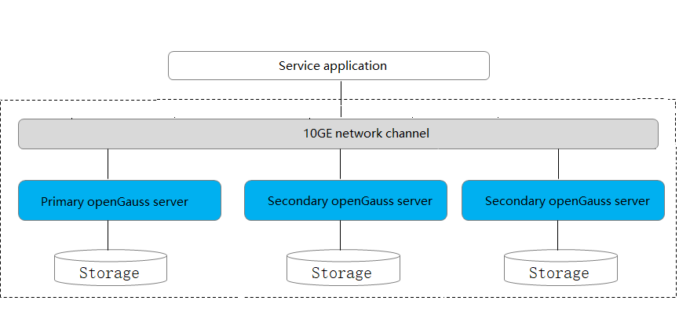

# Deployment with One Primary and Multiple Standbys

The multi-copy deployment mode provides the capability of defending against instance-level faults. This mode is applicable to scenarios where equipment room DR is not required but some hardware faults need to be prevented.

Generally, the one-primary and two-standby mode is used for multi-copy deployment. There are three copies in total. The reliability of the three copies is 99.99%, which can meet the reliability requirements of most applications.

-   In primary/standby DN quorum replication, data is synchronized to at least one standby to ensure the maximum performance.
-   If any of primary and standby DNs is faulty, services will not be affected.
-   There are three copies of data. If one node is faulty, the system still has two copies of data. In addition, any standby DN can be promoted to primary.
-   The primary and standby instances cannot be deployed on the same physical machine.

**Figure  1**  One-primary and multiple-standby deployment  

