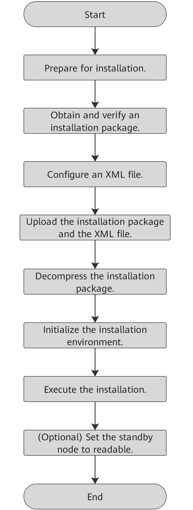

# Installation Process

This section describes the openGauss installation process.

[Figure 1](#fig18264185162412)  shows the process for installing openGauss.

**Figure  1**  Installation process  

**Table  1**  Installation process description

<table><thead align="left"><tr id="en-us_topic_0241802562_row16134722161419"><th class="cellrowborder" valign="top" width="19.439999999999998%" id="mcps1.2.3.1.1">
Step

</th>
<th class="cellrowborder" valign="top" width="80.56%" id="mcps1.2.3.1.2">
Description

</th>
</tr>
</thead>
<tbody><tr id="en-us_topic_0241802562_row1528811611512"><td class="cellrowborder" valign="top" width="19.439999999999998%" headers="mcps1.2.3.1.1 ">
Prepare for installation.

</td>
<td class="cellrowborder" valign="top" width="80.56%" headers="mcps1.2.3.1.2 ">
Before the openGauss installation, you need to prepare the software and hardware environment and related configurations.

This document provides the minimum requirements for the openGauss installation. In the actual installation, plan the installation based on the site requirements.

For details, see <a href="preparing-for-installation.md">Preparing for Installation</a>.

</td>
</tr>
<tr id="en-us_topic_0241802562_row12410032134912"><td class="cellrowborder" valign="top" width="19.439999999999998%" headers="mcps1.2.3.1.1 ">
Obtain and verify an installation package.

</td>
<td class="cellrowborder" valign="top" width="80.56%" headers="mcps1.2.3.1.2 ">
You need to download the installation package from the official website and verify the installation package. For details, see <a href="obtaining-and-verifying-an-installation-package.md">Obtaining and Verifying an Installation Package</a>.

</td>
</tr>
<tr id="en-us_topic_0241802562_row163283014916"><td class="cellrowborder" valign="top" width="19.439999999999998%" headers="mcps1.2.3.1.1 ">
Configure an XML file.

</td>
<td class="cellrowborder" valign="top" width="80.56%" headers="mcps1.2.3.1.2 ">
Before installing the openGauss, you need to create a configuration file. The configuration file in the XML format contains the information about the server where the openGauss is deployed, installation path, IP address, and port number. This file is used to guide how to deploy the openGauss. You need to configure the configuration file according to the actual deployment requirements.

For details, see <a href="creating-a-configuration-file.md">Creating a Configuration File</a>.

</td>
</tr>
<tr id="en-us_topic_0241802562_row670315277496"><td class="cellrowborder" valign="top" width="19.439999999999998%" headers="mcps1.2.3.1.1 ">
Initialize the installation environment.

</td>
<td class="cellrowborder" valign="top" width="80.56%" headers="mcps1.2.3.1.2 ">
To initialize the installation environment, you need to upload the installation package and the XML file, decompress the installation package, and use <strong id="b11413104010545">gs_preinstall</strong> to prepare the installation environment.

For details, see <a href="initializing-the-installation-environment.md">Initializing the Installation Environment</a>.

</td>
</tr>
<tr id="en-us_topic_0241802562_row143781321144912"><td class="cellrowborder" valign="top" width="19.439999999999998%" headers="mcps1.2.3.1.1 ">
Execute the installation.

</td>
<td class="cellrowborder" valign="top" width="80.56%" headers="mcps1.2.3.1.2 ">
You need to use <strong id="b1588155195417">gs_install</strong> to install the openGauss.

For details, see <a href="executing-installation.md">Executing Installation</a>.

</td>
</tr>
<tr id="row895121316211"><td class="cellrowborder" valign="top" width="19.439999999999998%" headers="mcps1.2.3.1.1 ">
Set the standby node to readable.

</td>
<td class="cellrowborder" valign="top" width="80.56%" headers="mcps1.2.3.1.2 ">
This operation is optional. After the readable standby node function is enabled, the standby node is readable, meeting data consistency requirements.

</td>
</tr>
</tbody>
</table>

