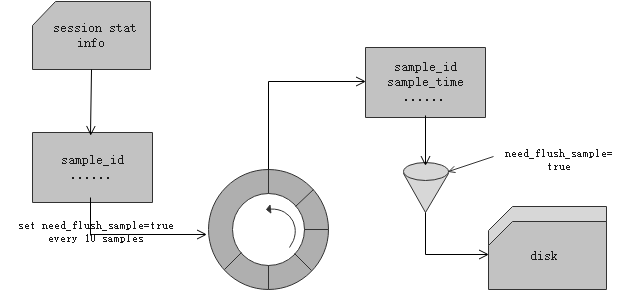

# Session性能诊断<a name="ZH-CN_TOPIC_0000001088406684"></a>

## 可获得性<a name="section5314201001"></a>

本特性自openGauss 1.0.0 版本开始引入。

## 特性简介<a name="section1982512281105"></a>

Session性能诊断提供给用户Session级别的性能问题诊断。

## 客户价值<a name="section103250353016"></a>

-   查看最近用户Session最耗资源的事件。
-   查看最近比较占资源的SQL把资源都消耗在哪些等待事件上。
-   查看最近比较耗资源的Session把资源都花费在哪些等待事件上。
-   查看最近最耗资源的用户的信息。
-   查看过去Session相互阻塞的等待关系。

## 特性描述<a name="section518134519015"></a>

Session性能诊断提供对当前系统所有活跃Session进行诊断的能力。由于实时采集所有活跃Session的指标对用户负载的影响加大，因此采取Session快照的技术对活跃Session的指标进行采样。

从采样中统计出活跃Session的统计指标，这些统计指标从客户端信息、执行开始、结束时间、SQL文本、等待事件、当前数据库对象等维度，反映活跃Session的基本信息、状态、持有的资源。

基于概率统计的活跃Session信息，可以帮助用户诊断系统中哪些Session消耗了更多的CPU、内存资源，哪些数据库对象是热对象，哪些SQL消耗了更多的关键事件资源等，从而定位出有问题Session、SQL、数据库设计。

Session采样数据分为两级，如[图1](#fig197862247217)所示：

1.  第一级为实时信息，存储在内存中，展示最近几分钟的活跃Session信息，具有最高的精度；
2.  第二级为持久化历史信息，存储在磁盘文件中，展示过去很长一段时间的历史活跃Session信息，从内存数据中抽样而来，适合长时间跨度的统计分析。

**图 1**  Session性能诊断原理<a name="fig197862247217"></a>  


部分使用场景如下所示：

1. 查看session之间的阻塞关系

   ```
   select sessionid, block_sessionid from pg_thread_wait_status;
   ```

2. 采样blocking session信息

   ```
   select sessionid, block_sessionid from DBE_PERF.local_active_session;
   ```

3. Final blocking session展示

   ```
   select sessionid, block_sessionid, final_block_sessionid from DBE_PERF.local_active_session;
   ```

4.  最耗资源的wait event

    ```
    SELECT s.type, s.event, t.count
    FROM dbe_perf.wait_events s, (
    SELECT event, COUNT (*)
    FROM dbe_perf.local_active_session
    WHERE sample_time > now() - 5 / (24 * 60)
    GROUP BY event)t WHERE s.event = t.event ORDER BY count DESC;
    ```
    
    
    
5. 查看最近五分钟较耗资源的session把资源都花费在哪些event上

   ```
   SELECT sessionid, start_time, event, count
       FROM (
   SELECT sessionid, start_time, event, COUNT(*)
       FROM dbe_perf.local_active_session
   WHERE sample_time > now() - 5 / (24 * 60)
       GROUP BY sessionid, start_time, event) as t ORDER BY SUM(t.count) OVER \(PARTITION BY t. sessionid, start_time)DESC, t.event;
   ```

6. 最近五分钟比较占资源的SQL把资源都消耗在哪些event上

   ```
   SELECT query_id, event, count
       FROM (
   SELECT query_id, event, COUNT(*)
       FROM dbe_perf.local_active_session
   WHERE sample_time > now() - 5 / (24 * 60)
       GROUP BY query_id, event) t ORDER BY SUM (t.count) OVER (PARTITION BY t.query_id ) DESC, t.event DESC;
   ```

## 特性增强

无。

## 特性约束

无。

## 依赖关系

无。