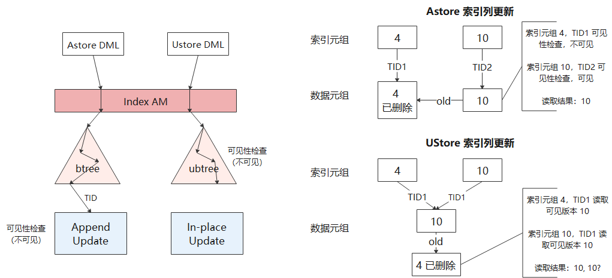
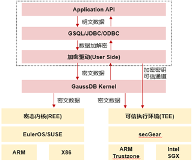
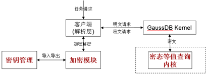
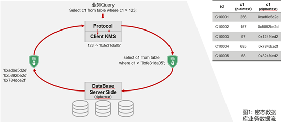

# 企业级增强特性

## 数据分区

数据分区是数据库产品普遍具备的功能。在openGauss中，数据分区是对数据按照用户指定的策略对数据做的水平分表，将表按照指定范围划分为多个数据互不重叠的部分（Partition）。

openGauss支持：

-   范围分区（Range Partitioning）功能，即根据表的一列或者多列，将要插入表的记录分为若干个范围（这些范围在不同的分区里没有重叠），然后为每个范围创建一个分区，用来存储相应的数据。
-   列表分区（List Partitioning）功能，即根据表的一列，将要插入表的记录中出现的键值分为若干个列表（这些列表在不同的分区里没有重叠），然后为每个列表创建一个分区，用来存储相应的数据。
-   哈希分区（Hash Partitioning）功能，即根据表的一列，通过内部哈希算法将要插入表的记录划分到对应的分区中。用户在CREATE TABLE时增加PARTITION参数，即表示针对此表应用数据分区功能。

例如，[表1](#zh-cn_topic_0283136537_zh-cn_topic_0237080621_zh-cn_topic_0231764089_zh-cn_topic_0059777656_t77b9e09809f742f1aaadea05d041bc23)描述了一个xDR（详单）场景下，基于时间分片的方式分区后带来的收益。

**表 1**  分区收益

<table><thead align="left"><tr id="zh-cn_topic_0283136537_zh-cn_topic_0237080621_zh-cn_topic_0231764089_zh-cn_topic_0059777656_r136f4522bccc4ec8ac473a07709c0737"><th class="cellrowborder" valign="top" width="50%" id="mcps1.2.3.1.1">
场景描述

</th>
<th class="cellrowborder" valign="top" width="50%" id="mcps1.2.3.1.2">
收益

</th>
</tr>
</thead>
<tbody><tr id="zh-cn_topic_0283136537_zh-cn_topic_0237080621_zh-cn_topic_0231764089_zh-cn_topic_0059777656_rdfb6ee78653a46059253db9ed1e35114"><td class="cellrowborder" valign="top" width="50%" headers="mcps1.2.3.1.1 ">
当表中访问率较高的行位于一个单独分区或少数几个分区时。

</td>
<td class="cellrowborder" valign="top" width="50%" headers="mcps1.2.3.1.2 ">
大幅减少搜索空间，从而提升访问性能。

</td>
</tr>
<tr id="zh-cn_topic_0283136537_zh-cn_topic_0237080621_zh-cn_topic_0231764089_zh-cn_topic_0059777656_r7ddefafe50e44ec0bddd409e82ecafa5"><td class="cellrowborder" valign="top" width="50%" headers="mcps1.2.3.1.1 ">
当需要查询或更新一个分区的大部分记录时。

</td>
<td class="cellrowborder" valign="top" width="50%" headers="mcps1.2.3.1.2 ">
仅需要连续扫描对应分区，而非扫描整个表，因此可大幅提升性能。

</td>
</tr>
<tr id="zh-cn_topic_0283136537_zh-cn_topic_0237080621_zh-cn_topic_0231764089_zh-cn_topic_0059777656_r569c0fbda7794f0b9d7c2f11ab573eab"><td class="cellrowborder" valign="top" width="50%" headers="mcps1.2.3.1.1 ">
当需要大量加载或者删除的记录位于一个单独分区或少数几个分区时。

</td>
<td class="cellrowborder" valign="top" width="50%" headers="mcps1.2.3.1.2 ">
可直接读取或删除对应分区，从而提升处理性能；同时由于避免大量零散的删除操作，可减少清理碎片工作量。

</td>
</tr>
</tbody>
</table>

数据分区带来的好处在于：

-   **改善可管理性：**利用分区，可以将表和索引划分为一些更小、更易管理的单元。这样，数据库管理员在进行数据管理时就能采取“分而治之”的方法。 有了分区，维护操作可以专门针对表的特定部分执行。
-   **可提升删除操作的性能：**删除数据时可以删除整个分区，与分别删除每行相比，这种操作非常高效和快速。

    删除分区表与删除普通表的语法一致，都是通过DROP TABLE语法进行删除。

-   **改善查询性能：**通过限制要检查或操作的数据数量，分区可带来许多性能优势。

    分区剪枝：分区剪枝（也称为分区消除）是openGauss在执行时过滤掉不需要扫描的分区，只对相关的分区进行扫描的技术。分区剪枝通常可以将查询性能提高若干数量级。

-   **智能化分区联接：**通过使用一种称为智能化分区联接的技术，分区还可以改善多表联接的性能。当将两个表联接在一起，并且至少其中一个表使用联接键进行分区时，可以应用智能化分区联接。智能化分区联接将一个大型联接分为多个较小的联接，这些较小的联接包含与联接的表“相同”的数据集。这里，“相同”定义为恰好包含联接的两端中相同的分区键值集，因此可以确保只有这些“相同”数据集的联接才会有效，而不必考虑其他数据集，目前不支持列表分区和哈希分区。

## 向量化执行和行列混合引擎

在大宽表，数据量比较大、查询经常关注某些列的场景中，行存储引擎查询性能比较差。例如气象局的场景，单表有200\~800个列，查询经常访问10个列，在类似这样的场景下，向量化执行技术和列存储引擎可以极大的提升性能和减少存储空间。

-   向量化执行

    标准的迭代器模型如[图1](#zh-cn_topic_0283136537_zh-cn_topic_0237080624_zh-cn_topic_0231764690_zh-cn_topic_0059777898_f9d90aebe179a40759039d0263492489d)所示。控制流向下（下图实线）、数据流向上（下图虚线）、上层驱动下层（上层节点调用下层节点要数据）、一次一元组（下层节点每次只返回一条元组给上层节点）。

    而向量化执行相对于传统的执行模式改变是对于一次一元组的模型修改为一次一批元组，配合列存特性，可以带来巨大的性能提升。

    **图 1**  向量化执行引擎  
    

    .png)

-   行列混合存储引擎

    openGauss支持行存储和列存储两种存储模型，用户可以根据应用场景，建表的时候选择行存储还是列存储表。

    一般情况下，OLAP类业务场景（范围统计类查询和批量导入操作频繁，更新、删除、点查和点插操作不频繁，表的字段比较多，即大宽表，查询中涉及到的列不是很多）下，适合列存储，OLTP类业务场景（点查、点插、删除、更新频繁，范围统计类查询和批量导入操作不频繁，表的字段个数比较少，查询大部分字段）下，适合行存储。

    如[图2](#zh-cn_topic_0283136537_zh-cn_topic_0237080624_zh-cn_topic_0231764690_zh-cn_topic_0059777898_fbb2af39ce12a419cb437829aaf1cf4fb)所示，行列混合存储引擎可以同时为用户提供更优的数据压缩比（列存）、更好的索引性能（列存）、更好的点更新和点查询（行存）性能。

    **图 2**  行列混存引擎  
    

    

    当前列存储引擎有以下约束：

    -   DDL仅支持CREATE/DROP/TRUNCATE TABLE的功能。

        兼容分区的DDL管理功能（如：ADD/DROP/MERGE PARTITION，EXCHANGE功能）。

        支持CREATE TABLE LIKE语法。

        支持ALTER TABLE的部分语法。

        其他功能都不支持。

    -   DML支持UPDATE/COPY/BULKLOAD/DELETE。
    -   不支持触发器，不支持主外键。
    -   支持Psort index、B-tree index和GIN index，具体约束参见《开发者指南》中“SQL参考 \> SQL语法 \> CREATE INDEX”章节。

-   列存下的数据压缩

    对于非活跃的早期数据可以通过压缩来减少空间占用，降低采购和运维成本。

    openGauss列存储压缩支持Delta Value Encoding、Dictionary、RLE 、LZ4、ZLIB等压缩算法，且能够根据数据特征自适应的选择压缩算法，平均压缩比7:1。压缩数据可直接访问，对业务透明，极大缩短历史数据访问的准备时间。

## 融合存储引擎

融合引擎架构支持了可插拔存储引擎的架构，新增了In-place update存储引擎，索引多版本为索引增加了事务信息，Xlog无锁刷新极大提升了Xlog写入效率，并行Page回放提升了备机回放效率，企业级特性闪回为用户提供了一个稳定的查询状态。

-   In-place update存储引擎

    新增的In-place update存储引擎很好的解决了Append update存储引擎空间膨胀，元组较大的劣势，高效回滚段的设计是In-place update存储引擎的基础。

-   索引多版本

    **图 3**  UBTree与BTree查找、更新比较示意图  
    

    通过在索引页面元组上维护版本信息，UBtree能够在索引层进行 MVCC 可见性检查。同时 UBtree 也能通过版本信息独立判断索引元组是否已经无效（Dead），进而使得 in-place update引擎能实现数据表以及索引表上页级的空间清理，并在此基础上构建不依赖 AutoVacuum 的独立垃圾回收机制。

-   Xlog无锁刷新

    **图 4**  Xlog lock less Design  
    

    本特性对WalInsertLock进行优化，利用LSN（Log Sequence Number）及LRC（Log Record Count）记录了每个backend的拷贝进度，取消WalInsertLock机制。在backend将日志拷贝至WalBuffer时，不用对WalInsertLock进行争抢，可直接进行日志拷贝操作。并利用专用的WalWriter写日志线程，不需要backend线程自身来保证XLog的Flush。通过以上优化，取消WalInsertLock争抢及WalWriter专用磁盘写入线程，在保持原有XLog功能不变的基础上，可进一步提升系统性能。

-   并行Page回放

    本特性针对Ustore Inplace update WAL log写入，Ustore DML operation并行回放分发进行优化。通过利用Prefix和suffix来减少update WAL log的写入。通过把回放线程分多个类型来解决Ustore DML WAL大多都是多页面回放问题。同时把Ustore的数据页面回放按照blkno去分发，提高并行回放的并行程度。

-   企业级特性闪回

    闪回是数据库恢复技术的一环，能够使得DBA有选择性的高效撤销一个已提交事务的影响，将数据从人为的不正确的操作中进行恢复。在采用闪回技术之前，只能通过备份恢复、PITR等手段找回已提交的数据库修改，恢复时长需要数分钟甚至数小时。采用闪回技术后，恢复已提交的数据库修改前的数据，只需要秒级，而且恢复时间和数据库大小无关。

    本特性支持四种闪回实现：

    -   闪回查询：可以查询过去某个时间点表的某个snapshot数据，这一特性可用于查看和逻辑重建意外删除或更改的受损数据。闪回查询基于MVCC多版本机制，通过检索查询旧版本，获取指定老版本数据。
    -   闪回表：可以将表恢复至特定时间点，当逻辑损坏仅限于一个或一组表，而不是整个数据库时，此特性可以快速恢复表的数据。闪回表基于MVCC多版本机制，通过删除指定时间点和该时间点之后的增量数据，并找回指定时间点和当前时间点删除的数据，实现表级数据还原。
    -   闪回drop：可以恢复意外删除的表，从回收站（recycle bin）中恢复被删除的表及其附属结构如索引、表约束等。闪回drop是基于回收站机制，通过还原回收站中记录的表的物理文件，实现已drop表的恢复。
    -   闪回truncate：可以恢复误操作或意外被进行truncate的表，从回收站中恢复被truncate的表及索引的物理数据。闪回truncate基于回收站机制，通过还原回收站中记录的表的物理文件，实现已truncate表的恢复。

## 高可靠事务处理

openGauss提供事务管理功能，保证事务的ACID特性。

为了在主节点出现故障时尽可能地不中断服务，openGauss提供了主备双机高可靠机制。通过保护关键用户程序对外不间断提供服务，把因为硬件、软件和人为造成的故障对业务的影响程度降到最低，以保证业务的持续性。

**故障恢复**

支持节点故障可恢复及恢复后满足ACID特性。节点故障、停止后重启等情况下，openGauss能够保证故障之前的数据无丢失，满足ACID特性。

**事务管理**

-   支持事务块，用户可以通过start transaction命令显式启动一个事务块。
-   支持单语句事务，用户不显式启动事务，则单条语句就是一个事务。

## 高并发&高性能

openGauss通过服务器端的线程池，可以支持1W并发连接。通过NUMA化内核数据结构，支持线程亲核性处理，可以支持百万级tpmC。通过页面的高效冷热淘汰，支持T级别大内存缓冲区管理。通过CSN快照，去除快照瓶颈，实现多版本访问，读写互不阻塞。通过增量检查点，避免全页写导致的性能波动，实现业务性能平稳运行。

## SQL自诊断

通过执行查询对应的explain performance，获得对应执行计划，是一种十分有效的定位查询性能问题的方法。但是这种方法需要修改业务逻辑，同时输出的日志量大，问题定位的效率依赖于人员的经验。SQL自诊断为用户提供了另一种更为高效易用的性能问题定位方法。

在执行作业之前，配置GUC参数resource\_track\_level和resource\_track\_cost，然后运行用户作业，就可以通过查看相关系统视图，获得执行完成的相关查询作业可能存在的性能问题。系统视图中会给出导致性能问题的可能原因，根据这些“性能告警”，参考《开发者指南》中“性能调优 \> SQL调优指南 \> 典型SQL调优点 \> SQL自诊断”章节，就可以对存在性能问题的作业进行调优。

SQL自诊断可以在不影响用户作业，不修改业务逻辑的情况下，诊断出相对准确的性能问题，为用户提供更为易用的性能调优参考。

## 全密态数据库等值查询

伴随着云基础设施的快速增长和成熟，与之对应的云数据库服务也层出不穷。云数据库俨然已成为数据库业务未来重要的增长点，绝大多数的传统数据库服务厂商正在加速提供更优质的云数据库服务。但无论是传统的线下数据库服务，还是日益增长的云数据库服务，数据库的核心任务都是帮助用户存储和管理数据，在复杂多样的环境下，保证数据不丢失、隐私不泄露、数据不被篡改，同时服务不中断。这就要求数据库具体多层次的安全防御机制，用来抵抗来自多方面的恶意攻击行为。通过成熟的安全技术手段，构建数据库多层级安全防御体系，保障数据库在应用中的安全。因此，为了更好的保护敏感和隐私数据，特别是针对云数据库服务，急需一种能在服务器端彻底解决数据全生命周期隐私保护的系统性解决方案，该方案被称为密态数据库解决方案。

-   密态数据库总体方案

    密态等值查询属于密态数据库第一阶段方案，但是遵从密态数据库总体架构。密态数据库的总体架构示意图如[图5](#zh-cn_topic_0231763017_fig141362033122319)所示。密态数据库的完整形态包括密码学方案和软硬结合方案。

    **图 5**  密态数据库总体架构  
    

    

    由于密态等值查询仅涉及到软件部分，仅需集成密态数据库总体架构的软件部分，其总体实现方案如[图6](#fig18836194875513)所示。

    **图 6**  密态等值查询总体方案  
    

    

    从总体流程上来看，数据在客户端完成加密，以密文形式发送到openGauss数据库服务侧，即需要在客户端构建加解密模块。加解密模块依赖密钥管理模块，密钥管理模块生成根密钥（RK, Root Key）和客户端主密钥（CMK，Client Master Key）。有了CMK，可以通过SQL语法定义列加密密钥（CEK，Column Encryption Key），CMK由RK加密后保存在密钥存储文件（KSF，Key Store File）中，CMK和RK由KeyTool统一管理；CEK则由CMK加密后存储在服务端\(加密算法使用对称加密算法AES256\)和国密算法SM2。

    客户端依据生成的CEK来对数据进行加密，数据加密算法主要使用对称加密算法AES算法\(包括AES128和AES256\)和国密算法SM4。加密后的数据会存放在数据库服务端，经过密文运算后服务端返回密文结果集，并在客户端完成最后的解密，获取最终结果。

    用户根据业务需要对数据定义加密属性信息（被加密的列被称之为加密列），对于不需要加密的数据则按照原有明文格式发送至服务端。当查询任务发起后，客户端需要对当前的Query进行解析，如果查询语句中涉及加密列，则对对应的列参数（加密列关联参数）也要进行加密（这里说的加密均需要为确定性加密，否则无法支持对应的查询）；如果查询语句中不涉及加密列，则直接发送至服务端，无需额外的操作。

    在数据库服务侧，加密列的数据始终以密文形态存在，整个查询也在密文形态下实现。对于第一阶段密态等值查询解决方案，需要采用确定性加密，使得相同的明文数据获得相同的密文，从而支持等值计算。

-   密态数据库数据流图

    **图 7**  密态数据库数据流图  
    

    从该数据流图中可以看出，密态数据库允许客户端对客户端应用程序内的敏感数据进行加密。在查询期间，整个业务数据流在数据处理过程中都是以密文形态存在。优势如下：

    -   保护数据在云上全生命周期的隐私安全；
    -   通过将密钥掌握在用户自己手上，实现公有云、消费者云以及开发用户的用户信任问题；
    -   让云数据库借助全密态能力更好的遵守个人隐私保护方面的法律法规。

-   使用场景

    混合云场景：数据库客户端和数据库服务端部均署于用户私有网络，客户端采用华为管控界面。

    公有云场景：数据库客户端在用户本地，数据库服务端在华为云。

    公有云服务：数据库客户端和数据库服务端均在华为云。

## 内存表

内存表把数据全部缓存在内存中，所有数据访问实现免锁并发，实现数据处理的极致性能，满足实时性严苛要求场景。

## 支持多存储引擎

openGauss基于统一的事务机制，统一的日志系统，统一的并发控制系统，统一的元信息信息，统一缓存管理提供Table Access Method接口，支持不同的存储引擎。

目前支持Astore和Ustore存储引擎。

## 主备双机

主备双机支持同步和异步复制，应用可以根据业务场景选择合适的部署方式。同步复制保证数据的高可靠，一般需要一主两备部署，同时对性能有一定影响。异步复制一主一备部署即可，对性能影响小，但异常时可能存在数据丢失。openGauss支持页面损坏的自动修复，在主机页面发生损坏时，能够自动从备机修复损坏页面。openGauss支持备机并行日志恢复，尽量降低主机故障时业务不可用的时间。

同时，如果按照主备模式部署，并打开备机可读功能后，备机将能够提供读操作，但不支持写操作（如建表、插入数据、删除数据等），从而缓解主机上的压力。

## 具备AI能力

-   参数自动调优

    在数据库场景中，不同类型的作业任务对于数据库的最优参数数值组合存在偏差。为了获得更好的运行性能，用户希望快速将数据库的参数调整到最优状态。人工调参的学习成本高且不具有实时性和广泛可用。通过机器学习方法自动调整数据库参数，有助于提高调参效率，降低正确调参成本。

    参数自动调优：参数调优服务支持离线与在线两种服务形式，支持多种算法，包括强化学习、全局搜索算法等。

    当模型处于训练阶段中，根据输入的数据库参数数值（其中包括数据库当前参数数值以及数据库当前性能参数数值）通过强化学习和启发式算法得到新的参数数值组合，数据库的参数调整由强化学习和启发式算法两个组成部分的输出结果混合得到，将模型的输出经过反归一化得到新的参数数值，将新的数值植入数据库并运行测试作业得到当前数值组合下数据库的性能表现，如执行时长、吞吐量等指标。最后将表现作为反馈给学习模型，往复迭代。

    当模型处于调优阶段中，将当前数据库的参数数值作为输入，其中包括数据库当前参数数值以及数据库当前性能参数数值。通过模型得到当前情况下的所能得到的最优参数调整方案。

    当模型处于推荐模式下，会直接根据用户当前Workload的特征进行秒级参数推荐。

-   慢SQL发现

    在实际生产环境中，用户通常希望作业能够以最快的方式执行成功。然而实际由于语句的复杂度不同，各个语句的执行时间并不相同。用户希望能在语句执行之前识别这些执行时间长的语句，将它们单独执行以免过长时间的锁影响其他语句的执行效果。与此同时，这种提前识别的功能又不能占用用户数据库本来的资源或影响数据库本来的响应时间。

    慢SQL诊断特性利用机器学习算法构建AI框架， 对语句进行语义结构的解析，并以此为基础，定性或定量地预测未知语句的执行时间，满足用户提前识别慢SQL语句的要求。

    慢SQL诊断有两个主要阶段：训练阶段和预测阶段。

    -   训练阶段：用户准备好自己的典型业务SQL历史记录，通过用户输入的日志地址导入历史SQL数据，训练智能模型。
    -   预测阶段：用户输入待预测负载，模型根据每类的历史信息预测执行时间，从而发现潜在慢SQL。

-   索引推荐

    支持单Query索引推荐与Workload级别索引推荐。在进行Workload级别索引推荐时，先根据AI算法，筛选出具有代表性的SQL语句。然后针对代表性的SQL语句，基于语句的语义信息和数据库的统计信息，生成最优的推荐索引。将所有语句的推荐索引作为候选索引集合，然后计算每条候选索引对workload的收益，推荐出收益最大的索引组合方案。

-   时序预测与异常检测

    支持采集部署数据库宿主机上的特征信息，并将上述时序特征数据收集并存储起来。利用上述存储的数据进行时序预测，例如存储空间预测等。还支持根据上述数据进行潜在异常问题的发现， 能够先知先觉地发现可能出现的问题，并作出提前部署。

-   支持DB4AI功能

    兼容MADlib生态，支持70+算法，性能比原生MADlib有数倍提升，支持XGBoost、GBDT等高级算法。利用数据库实现SQL语句驱动AI任务。

-   SQL执行时间预测

    在查询性能调优、业务负载分析等场景，用户经常需要对SQL的执行时间进行预测，目前数据库优化器主要基于代价模型，无法准确预测执行时间。该特性通过AI模型，能够对历史执行过的查询或相似查询进行时间预测，满足SQL执行时间预测要求。

    SQL执行时间预测：根据收集的历史性能数据进行编码和基于深度学习的训练及预测。

    历史数据收集由数据库内核进程完成，内核进程通过curl向python端AI引擎发送https请求来（1）配置机器学习模型、（2）发送训练数据、（3）触发模型训练、（4）请求训练过程监测服务端口、（5）加载用于训练的模型、（6）使用加载好的模型进行预测。数据的编码阶段在数据库中完成，保证出库数据已脱敏。模型的预测阶段需要在查询计划生成后对整个计划进行编码并写文件发给python端，python端tensorflow计算图只需要加载一次，可以进行高度并行化的批量预测。

-   数据库监控

    在日常运维过程中，用户需要持续对数据库运行状态进行监控，但是数据库内部的复杂性导致用户难以高效的提取关键数据。实现数据库自监控能够提升用户运维效率，用户只需要关心核心指标和异常数据。

    1.  事务概要信息包括提交（commit\_counter）和回滚（rollback\_counter）的事务数，事务响应时间。提交和回滚的事务数、事务的响应时间都是自上次重启后的累计值。
    2.  Workload SQL 概要信息包括一个workload内DDL，DCL，DML分布，还包含DML类型中SELECT、UPDATE、INSERT、DELETE的个数。SQL类型分布是自上次重启后的累计值。
    3.  Workload SUID时间概要信息包括一个workload内Select、Update、Insert、Delete的耗时（累计，平均，最大，最小）。
    4.  SQL response time percentile概要信息包括过去一段时间系统中80%和95%的SQL响应时间。
    5.  Waitevents概要信息只包括单独节点上的事件等待信息，不包含全局汇聚信息。主要包括等待状态STATUS，IO事件IO\_EVENT，Lock事件LOCK\_EVENT，Lwlock事件LWLOCK\_EVENT的成功等待次数，失败等待次数，事件在节点上等待的总时间，事件最小等待时间，事件最大等待时间，事件平均等待时间。
    6.  对于进入到Parser的SQL，生成归一化的Unique SQL ID以及相应的SQL文本串。统计Unique SQL在各个执行阶段的时间消耗，从而依据时间分布进行SQL性能分析和调优；统计实例、会话在各个阶段的时间消耗，辅助系统整体性能调优。查询SQL执行次数 ,SQL内核响应时间， IO时间、CPU时间、网络传输时间等 ,物理、逻辑读 ,Select返回结果集数量、扫描元组数量、更新行、删除行、插入行等 ,新生成\(硬\)复用\(软\)计划次数。

## 逻辑日志复制

在逻辑复制中把主库称为源端库，备库称为目标端数据库，源端数据库根据预先指定好的逻辑解析规则对WAL文件进行解析，把DML操作解析成一定的逻辑变化信息（标准SQL语句），源端数据库把标准SQL语句发给目标端数据库，目标端数据库收到后进行应用，从而实现数据同步。逻辑复制只有DML操作。逻辑复制可以实现跨版本复制，异构数据库复制，双写数据库复制，表级别复制。

## 支持WDR自动性能分析报告

定时主动分析run日志和WDR报告（自动后台生成，可由关键指标阈值如CPU占用率、内存占用率、长SQL比例等触发），并生成html、pdf等格式的报告。能自动生成性能报告。WDR\(Workload Diagnosis Report\)基于两次不同时间点系统的性能快照数据， 生成这两个时间点之间的性能表现报表，用于诊断数据库内核的性能故障。

WDR主要有两个组件：

-   SNAPSHOT性能快照：性能快照可以配置成按一定时间间隔从内核采集一定量的性能数据，持久化在用户表空间。任何一个SNAPSHOT可以作为一个性能基线，其他SNAPSHOT与之比较的结果，可以分析出与基线的性能表现。
-   WDR Reporter：报表生成工具基于两个SNAPSHOT，分析系统总体性能表现，并能计算出更多项具体的性能指标在这两个时间段之间的变化量，生成SUMMARY 和DETAIL两个不同级别的性能数据。

## 增量备份/恢复（beta）

支持对数据库进行全量备份和增量备份，支持对备份数据进行管理，查看备份状态。支持增量备份的合并，过期备份的删除。数据库服务器动态跟踪页面更改，每当一个关系页被更新时，这个页就会被标记为需要备份。增量备份功能需要打开GUC参数 enable\_cbm\_tracking，以便允许服务器跟踪修改页。

## 恢复到指定时间点（PITR）

时间点恢复\(Point In Time Recovery\)基本原理是通过基础热备 + WAL预写日志 + WAL归档日志进行备份恢复。重放WAL记录的时候可以在任意点停止重放，这样就有一个在任意时间的数据库一致的快照。即可以把数据库恢复到自开始备份以来的任意时刻的状态。在恢复时可以指定恢复的停止点位置为TID，时间和LSN。

## 生成列

生成列是指由表中其他字段计算得到的列。生成列是一个SQL标准特性，SQL 生成列在插入或者更新数据时自动计算，像普通列一样需要占用存储空间。

## hash索引

openGauss支持HASH索引，长索引列等值查询场景下性能优于BTREE；优化锁管理提供更高的并发度；提供XLOG日志防护，保障数据不丢失。

## 支持国密算法

用户认证方式（gsql、JDBC、ODBC）支持国密SM3算法；提供国密SM4算法接口，用于对数据进行加解密，增强数据库的安全能力。

## 插件化架构

通过对SQL引擎中语法、语义的解耦，实现openGauss的语法、语义层插件化，实现异构数据库语法模块与openGauss内核的解耦；支持算子插件化，实现特定算子从计划创建、优化到执行的插件化。

## 其他

-   upsert支持子查询

    支持在upsert的更新语句之中使用子查询表达式进行赋值，且子查询表达式中支持通过excluded进行冲突行的引用。

-   列存表支持唯一索引

    支持在列存表上创建基于cbtree的唯一索引、创建主键唯一键约束，防止表中出现重复数据，扩展了列存表使用场景。

-   支持jsonb数据类型

    支持jsonb数据类型用来高效的操作JSON数据，支持对于json、jsonb的各种丰富的操作符、操作函数，支持在jsonb上创建索引，满足广泛的JSON使用与搜索场景。

-   UCE故障感知与响应

    通过感知内存UCE错误产生时系统发出的SIGBUS信号，并根据所携带的物理地址，实现对应日志打印与openGauss数据库状态变化，进入对应的数据库进程退出流程。

-   支持unique sql语句监控自动淘汰

    openGauss支持unique SQL自动淘汰，使用LRU算法依据uniqueSQL的更新时间自动淘汰旧的uniqueSQL信息，保障最新的统计信息能够持续记录，提高数据库的易运维性。

-   支持gs\_cgroup负载管理

    gs\_cgroup 负载管理工具，通过在数据库内核创建与管理控制组，设置系统资源配额和资源限额，来管理用户与业务对资源的使用率与优先级，充分高效的利用机器资源。

