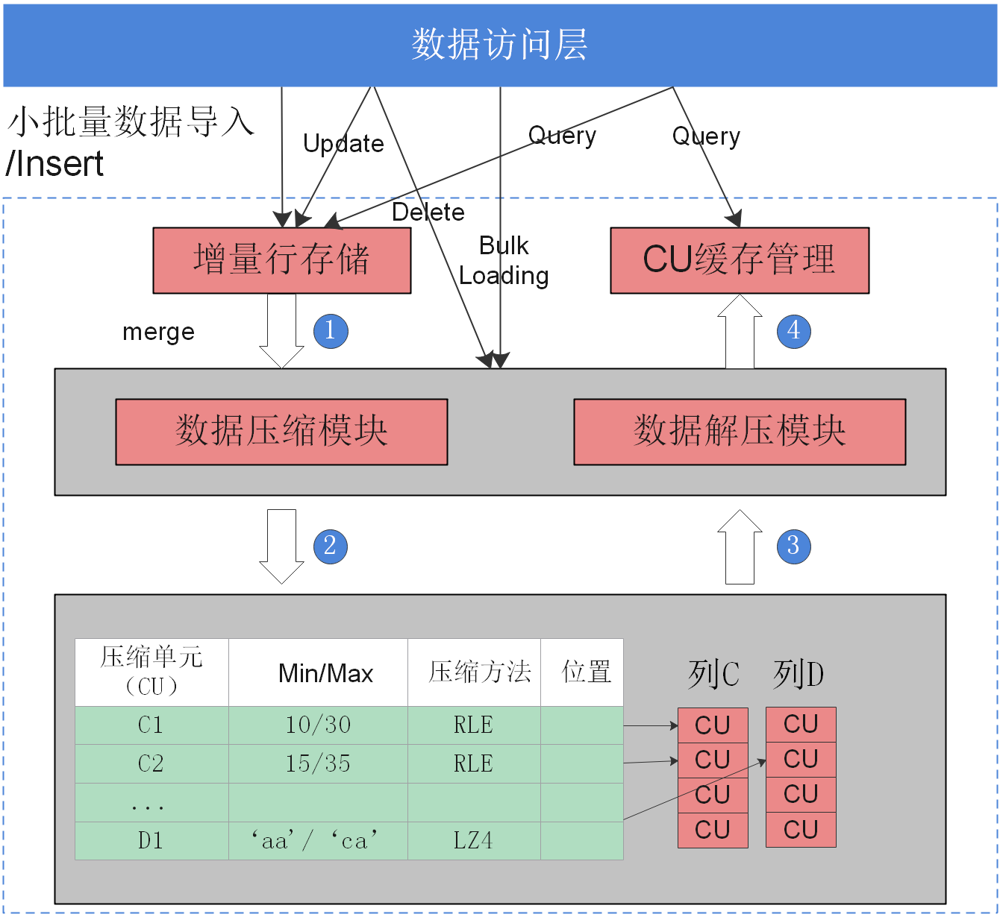

# 向量化执行和行列混合引擎

## 背景信息

在大宽表，数据量比较大、查询经常关注某些列的场景中，行存储引擎查询性能比较差。例如气象局的场景，单表有200\~800个列，查询经常访问10个列，在类似这样的场景下，向量化执行技术和列存储引擎可以极大的提升性能和减少存储空间。

## 向量化执行

标准的迭代器模型如[图1](#zh-cn_topic_0237080624_zh-cn_topic_0231764690_zh-cn_topic_0059777898_f9d90aebe179a40759039d0263492489d)所示。控制流向下（下图实线）、数据流向上（下图虚线）、上层驱动下层（上层节点调用下层节点要数据）、一次一元组（下层节点每次只返回一条元组给上层节点）。

而向量化执行相对于传统的执行模式改变是对于一次一元组的模型修改为一次一批元组，配合列存特性，可以带来巨大的性能提升。

**图 1**  向量化执行引擎  

.png)

## 行列混合存储引擎

openGauss支持行存储和列存储两种存储模型，用户可以根据应用场景，建表的时候选择行存储还是列存储表。

一般情况下，如果表的字段比较多（大宽表），查询中涉及到的列不很多的情况下，适合列存储。如果表的字段个数比较少，查询大部分字段，那么选择行存储比较好。

如[图2](#zh-cn_topic_0237080624_zh-cn_topic_0231764690_zh-cn_topic_0059777898_fbb2af39ce12a419cb437829aaf1cf4fb)所示，行列混合存储引擎可以同时为用户提供更优的数据压缩比（列存）、更好的索引性能（列存）、更好的点更新和点查询（行存）性能。

**图 2**  行列混存引擎  

当前列存储引擎有以下约束：

-   DDL仅支持CREATE/DROP/TRUNCATE TABLE的功能。

    兼容分区的DDL管理功能（如： ADD/DROP/MERGE PARTITION，EXCHANGE功能）。

    支持CREATE TABLE LIKE语法。

    支持ALTER TABLE的部分语法。

    其他功能都不支持。

-   DML支持UPDATE/COPY/BULKLOAD/DELETE。
-   不支持触发器，不支持主外键。
-   支持Psort index、B-tree index和GIN index，具体约束参见《开发者指南》中“SQL参考 \> SQL语法 \> CREATE INDEX”章节。

## 列存下的数据压缩

对于非活跃的早期数据可以通过压缩来减少空间占用，降低采购和运维成本。

openGauss列存储压缩支持Delta Value Encoding、Dictionary、RLE 、LZ4、ZLIB等压缩算法，且能够根据数据特征自适应的选择压缩算法，平均压缩比7:1。压缩数据可直接访问，对业务透明，极大缩短历史数据访问的准备时间。

