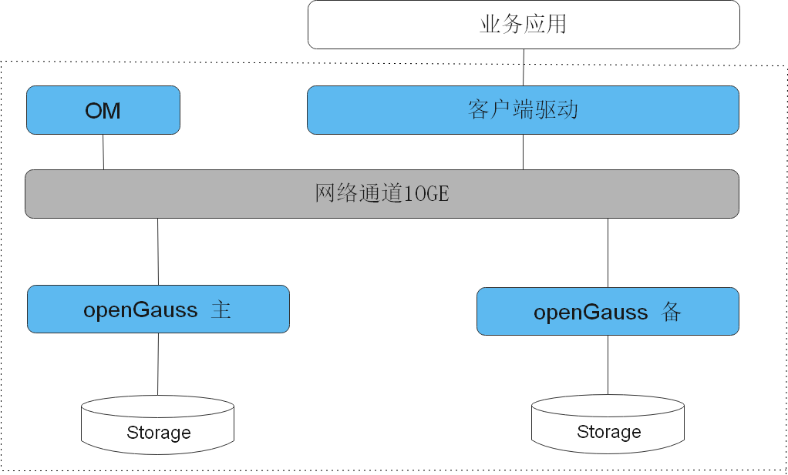

# 软件架构

openGauss主要包含了openGauss服务器，客户端驱动，OM等模块，本章将介绍这些模块之间的相互关系。

openGauss软件的架构如[图1](#f078d2fc7ab574c8aa05c4a988e0df1b3)所示。在openGauss的文档中，将openGauss服务器称为实例。

**图 1**  软件架构  

图中各模块的含义详见[表1](#t17e13a118cb14f5facbde93d2db56660)。

**表 1**  模块说明

<table><thead align="left"><tr id="r23e99de572e449a48226ecb3a7fdce97"><th class="cellrowborder" valign="top" width="14.530000000000001%" id="mcps1.2.4.1.1">
名称

</th>
<th class="cellrowborder" valign="top" width="32.09%" id="mcps1.2.4.1.2">
描述

</th>
<th class="cellrowborder" valign="top" width="53.38%" id="mcps1.2.4.1.3">
说明

</th>
</tr>
</thead>
<tbody><tr id="rfd4ccf9040a844d1a49cc65c144bb10c"><td class="cellrowborder" valign="top" width="14.530000000000001%" headers="mcps1.2.4.1.1 ">
OM

</td>
<td class="cellrowborder" valign="top" width="32.09%" headers="mcps1.2.4.1.2 ">
运维管理模块（Operation Manager）。提供openGauss日常运维、配置管理的管理接口、工具。

</td>
<td class="cellrowborder" valign="top" width="53.38%" headers="mcps1.2.4.1.3 ">
不同于服务器和客户端驱动模块，OM为用户提供了相关工具对openGauss实例进行管理。

</td>
</tr>
<tr id="r010b48617bed4420ad1ed1f7b5c6039a"><td class="cellrowborder" valign="top" width="14.530000000000001%" headers="mcps1.2.4.1.1 ">
客户端驱动

</td>
<td class="cellrowborder" valign="top" width="32.09%" headers="mcps1.2.4.1.2 ">
客户端驱动（Client Driver）。负责接收来自应用的访问请求，并向应用返回执行结果；负责与openGauss实例的通信，下发SQL在openGauss实例上执行，并接收命令执行结果。

</td>
<td class="cellrowborder" valign="top" width="53.38%" headers="mcps1.2.4.1.3 ">
负责接收来自应用的访问请求，并向应用返回执行结果。客户端驱动负责建立到openGauss实例的链接，把应用的SQL命令传输给openGauss实例，接收openGauss实例命令执行结果。

客户端驱动和应用运行在同一个进程内，部署在同一个物理节点。

</td>
</tr>
<tr id="r76b2e096c5fa4c4f9b26fb06ecb41827"><td class="cellrowborder" valign="top" width="14.530000000000001%" headers="mcps1.2.4.1.1 ">
openGauss主（备）

</td>
<td class="cellrowborder" valign="top" width="32.09%" headers="mcps1.2.4.1.2 ">
openGauss主（备）。负责存储业务数据（支持行存、列存、内存表存储）、执行数据查询任务以及向客户端驱动返回执行结果。

</td>
<td class="cellrowborder" valign="top" width="53.38%" headers="mcps1.2.4.1.3 ">
负责存储业务数据、执行数据查询任务以及向客户端驱动返回执行结果。

openGauss实例包含主、备两种类型。支持一主多备。建议将主、备openGauss分散部署在不同的物理节点中。

</td>
</tr>
<tr id="r239ecf59d9624912a07ca573b95d71e1"><td class="cellrowborder" valign="top" width="14.530000000000001%" headers="mcps1.2.4.1.1 ">
Storage

</td>
<td class="cellrowborder" valign="top" width="32.09%" headers="mcps1.2.4.1.2 ">
服务器的本地存储资源，持久化存储数据。

</td>
<td class="cellrowborder" valign="top" width="53.38%" headers="mcps1.2.4.1.3 ">
-

</td>
</tr>
</tbody>
</table>

