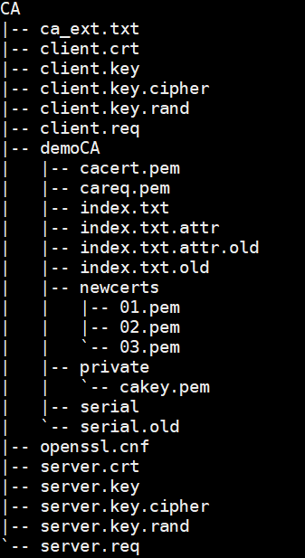

# 使用指导<a name="ZH-CN_TOPIC_0243558422"></a>

## 前提条件<a name="section7996611818"></a>

需要保证openGauss处于正常状态，用户通过身份验证成功登录openGauss；用户执行的SQL语法正确无报错，且不会导致数据库异常等；历史性能数据窗口内openGauss并发量稳定，表结构、表数量不变，数据量无突变，涉及查询性能的guc参数不变；进行预测时，需要保证模型已训练并收敛；AiEngine运行环境稳定。

## 证书生成<a name="section1446112144912"></a>

AiEngine进程与内核进程通信需要证书认证，需要使用openssl工具生成双方证书。

1.  搭建证书生成环境，证书文件保存路径为$GAUSSHOME/CA：

    --拷贝证书生成脚本及相关文件

    ```
     cp path_to_predictor/install/ssl.sh $GAUSSHOME/
    cp path_to_predictor/install/ca_ext.txt $GAUSSHOME/
    ```

    --copy 配置文件openssl.cnf到CA下

    ```
    cp /etc/openssl
    cp openssl.cnf  $GAUSSHOME/
    ```

    --修改openssl.conf配置参数

    ```
    dir  = $GAUSSHOME/CA/demoCA
    default_md      = sha256
    ```

    --至此证书生成环境准备完成

2.  生成证书及密钥

    ```
    cd $GAUSSHOME
    sh ssl.sh
    ```

    --根据提示设置密码，假如为Test@123：

    --密码要求至少3种不同类型字符，长度至少为8位

    ```
    Please enter your password: 
    ```

    --根据提示输入选项：

    ```
    
    Certificate Details:
            Serial Number: 1 (0x1)
            Validity
                Not Before: May 15 08:32:44 2020 GMT
                Not After : May 15 08:32:44 2021 GMT
            Subject:
                countryName               = CN
                stateOrProvinceName       = SZ
                organizationName          = HW
                organizationalUnitName    = GS
                commonName                = CA
            X509v3 extensions:
                X509v3 Basic Constraints:
                    CA:TRUE
    Certificate is to be certified until May 15 08:32:44 2021 GMT (365 days)
    Sign the certificate? [y/n]:y
    1 out of 1 certificate requests certified, commit? [y/n]y
    ```

    --输入拉起AIEngine的IP地址，如IP为127.0.0.1：

    ```
    Please enter your aiEngine IP: 127.0.0.1
    ```

    --根据提示输入选项：

    ```
    Certificate Details:
            Serial Number: 2 (0x2)
            Validity
                Not Before: May 15 08:38:07 2020 GMT
                Not After : May 13 08:38:07 2030 GMT
            Subject:
                countryName               = CN
                stateOrProvinceName       = SZ
                organizationName          = HW
                organizationalUnitName    = GS
                commonName                = 127.0.0.1
            X509v3 extensions:
                X509v3 Basic Constraints:
                    CA:FALSE
    Certificate is to be certified until May 13 08:38:07 2030 GMT (3650 days)
    Sign the certificate? [y/n]:y
    1 out of 1 certificate requests certified, commit? [y/n]y
    ```

    --输入启动OpenGauss IP地址，如IP为127.0.0.1：

    ```
    Please enter your gaussdb IP: 127.0.0.1
    ```

    --根据提示输入选项：

    ```
    Certificate Details:
            Serial Number: 3 (0x3)
            Validity
                Not Before: May 15 08:41:46 2020 GMT
                Not After : May 13 08:41:46 2030 GMT
            Subject:
                countryName               = CN
                stateOrProvinceName       = SZ
                organizationName          = HW
                organizationalUnitName    = GS
                commonName                = 127.0.0.1
            X509v3 extensions:
                X509v3 Basic Constraints:
                    CA:FALSE
    Certificate is to be certified until May 13 08:41:46 2030 GMT (3650 days)
    Sign the certificate? [y/n]:y
    1 out of 1 certificate requests certified, commit? [y/n]y
    ```

    --至此，相关证书及密钥已生成，（$GAUSSHOME/CA）内容如下：

    

3.  --

## 环境准备<a name="section172181735111420"></a>

1.  将工具代码文件夹拷贝至目标环境，代码路径：Code/src/gausskernel/dbmind/predictor。

    --假设目标环境路径为/home/ai\_user :

    ```
    scp -r predictor  ai_user@127.0.0.1:/home/ai_user/
    ```

2.  拷贝CA证书文件夹至aiEngine环境中某路径下：

    ```
    cp -r $GAUSSHOME/CA  ai_user@127.0.0.1:/home/ai_user/
    ```

3.  安装predictor/install/requirements\(-gpu\).txt工具：

    ```
    有GPU：pip install requirements-gpu.txt
    无GPU：pip install requirements.txt
    ```


## 拉起AiEngine<a name="section1643519117315"></a>

1.  切换至aiEngine环境（即拷贝predictor的目标环境 ai\_user）：

    设置predictor/python/settings.py 中的相关参数：

    ```
    DEFAULT_FLASK_SERVER_HOST = '127.0.0.1' （aiEngine运行IP地址）
    DEFAULT_FLASK_SERVER_PORT = '5000' （aiEngine运行端口号）
    PATH_SSL = "/home/ai_user/CA" (CA文件夹绝对路径)
    ```

2.  运行aiEngine启动脚本：

    ```
    run predictor/python/run.py
    ```

    此时，aiEngine即在相应端口保持拉起状态，等待内核侧时间预测功能的请求指令。

    至此，aiEngine工具部署完成。从内核中发起执行时间预测功能指令步骤，请参考《时间预测使用说明》。


